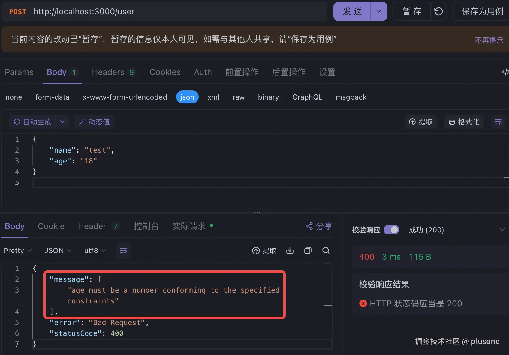

Controller 是 Nest 的核心组件之一，负责处理请求和响应。

# Controller 的创建和使用

1.  使用 nest cli 快速创建 Controller

```shell
nest g controller user
```

这条命令在 src 下创建一个 user 文件夹，其中包含 user.controller 文件，内容如下：

```ts
import { Controller } from "@nestjs/common";

@Controller("user")
export class UserController {}
```

2.  Controller 本质上是一个用 `@Controller` 装饰器装饰的类。

3.  Controller 中可以创建多个路由，每个路由对应不同的请求。比如下面的例子中分别定义了路径为 /user 的 Get 、Post 、Put 和 Delete 请求。

```ts
import { Controller, Get, Post, Put, Delete } from "@nestjs/common";

@Controller("user")
export class UserController {
  @Get("/")
  getUser() {}

  @Post("/")
  createUser() {}

  @Put("/")
  updateUser() {}

  @Delete("/")
  deleteUser() {}
}
```

4.  Controller 中可以通过 constructor 注入 provider，然后可以调用 service 来处理业务逻辑。

```ts
import { Controller, Get, Post, Put, Delete } from "@nestjs/common";
import { UserService } from "./user.service";

@Controller("user")
export class UserController {
  constructor(private userService: UserService) {}
  @Get("/")
  getUser() {
    return this.userService.getUser();
  }

  @Post("/")
  createUser() {}

  @Put("/")
  updateUser() {}

  @Delete("/")
  deleteUser() {}
}
```

5.  添加控制器到模块。

```ts
import { Module } from "@nestjs/common";
import { UserController } from "./user.controller";
import { UserService } from "./user.service";

@Module({
  controllers: [UserController],
  providers: [UserService],
})
export class UserModule {}
```

6.  尝试 curl 调用测试一下 Controller 中创建的路由


# 请求

## 路由

`@Controller` 装饰器可以传入一个路径，作为这个 Controller 类的基准路由。

### HTTP 方法装饰器

Nest 为所有标准的 HTTP 方法提供了对应的装饰器，比如 `@Get`、`@Post`、`@Put`、`@Delete` 等，被装饰的函数即对应请求的处理函数。`@All` 装饰器表示可以处理所有的 HTTP 请求方法。

HTTP 方法装饰器也可以传入路径，与 `@Controller` 装饰器传入的基准路由一起形成完整的路由，比如 `@Controller("user")` + `@Get("search")`，则最终的路由为 GET /user/search。

### 路由通配符

路由支持模式匹配，`*` 作为通配符，可以匹配任何字符组合。比如 `@Get("ab*cd")` 可以匹配 abcd、abxcd 等。

### 动态路由

可以通过 `:` 定义带参数的路由，即动态路由。比如 `@Get("/user/:id")` 可以匹配 /user/123 、/user/456 等等。

动态路由中的参数可以通过 `@Param` 装饰器获取，得到的结果是一个参数对象：

```ts
@Controller("")
export class UserController {
  @Get("/user/:id")
  getUser(@Param() params) {
    console.log(params); // { id: '123' }
  }
}
```

也可以对 `@Param` 装饰器传入字符串，直接得到参数值：

```ts
@Controller("")
export class UserController {
  @Get("/user/:id")
  getUser(@Param("id") id) {
    console.log(id); // 123
  }
}
```

## 请求参数获取

### 请求参数装饰器

Nest 内置提供了一系列请求参数装饰器用于获取请求参数，用法都和上面提到的 `@Param` 类似。

| 装饰器                 | 作用                                         |
| ---------------------- | -------------------------------------------- |
| `@Param(key?: string)` | 获取路径参数，req.params / req.params\[key]  |
| `@Query(key?: string)` | 获取 query 参数，req.query / req.query\[key] |
| `@Body(key?: string)`  | 获取请求体，req.body / req.body\[key]        |
| `@Request()`           | 获取 req 请求对象                            |

### 自定义参数装饰器

除了内置的参数装饰器，也可以自定义。比如登录成功，在 req 对象上添加 user 属性，我们自定义一个 `@User` 参数装饰器来获取这个属性。

1.  使用 `@nestjs/common` 提供的 `createParamDecorator` 定义装饰器函数，两个参数：`data` 为传入 `@User` 装饰器的参数，`ctx` 为上下文对象。
2.  通过 `ctx` 获取 `request` 对象，拿到 `request.user` 属性。
3.  如果有给 `@User` 装饰器传入参数，则从 `request.user` 上获取对应 key ，否则返回 `request.user` 整体。

```ts
import { createParamDecorator, ExecutionContext } from "@nestjs/common";
export const User = createParamDecorator(
  (data: string, ctx: ExecutionContext) => {
    const request = ctx.switchToHttp().getRequest();
    const user = request.user;
    return data ? user && user[data] : user;
  }
);
```

然后将其当作内置的参数装饰器一样使用：

```ts
@Get()
async findOne(@User('firstName') firstName: string) {
  console.log(`Hello ${firstName}`);
}
```

## DTO

DTO 即 Data Transfer Object，数据传输对象。

### 作用

DTO 用于明确指定传输的数据结构，有利于确保数据在传输中的一致性，便于维护；同时 DTO 在数据验证方面也发挥着重大作用。

### 创建 DTO

创建一个 user.dto.ts 文件，在其中创建 DTO 对象。

DTO 可以使用 `interface` 或 `class` 创建。推荐使用 `class`，原因是：`interface` 在编译后的代码中不存在；而 `class` 在编译后的代码中存在，实际参与执行，为运行时访问变量的元信息提供可能，这个特性也是通过**管道**（**Pipe**）进行数据验证的基础。

```ts
// 不推荐
export interface CreateUserDto {
  name: string;
  age: number;
}
// 推荐
export class CreateUserDto {
  name: string;
  age: number;
}
```

也可以使用继承的方式创建 DTO，比如在 `CreateUserDTO` 的基础上创建一个 `UpdateUserDTO`

```ts
export class UpdateUserDto extends CreateUserDto {
  id: number;
}
```

### 使用 DTO

在 user.controller.ts 的 createUser 和 updateUser 请求方法中分别使用 `CreateUserDTO` 和 `UpdateUserDTO` 描述请求体的数据结构。

```ts
@Controller("")
export class UserController {
  constructor(private userService: UserService) {}

  @Post("/")
  createUser(@Body() body: CreateUserDto) {
    return this.userService.createUser(body);
  }

  @Put("/")
  updateUser(@Body() body: UpdateUserDto) {
    return this.userService.updateUser(body);
  }
}
```

### 参数数据验证

使用 DTO 进行请求参数数据验证，需要依靠校验管道和 class-validator 库。

1.  在 app.module.ts 中添加全局校验管道

```ts
import { NestFactory } from "@nestjs/core";
import { ValidationPipe } from "@nestjs/common";
import { AppModule } from "./app.module";

async function bootstrap() {
  const app = await NestFactory.create(AppModule);
  app.useGlobalPipes(new ValidationPipe()); // 添加全局校验管道
  await app.listen(process.env.PORT ?? 3000);
}
bootstrap();
```

2.  在 user.dto.ts 中使用 class-validator 提供的装饰器装饰 DTO 类的属性。

```ts
import { IsString, IsNumber } from "class-validator";

export class CreateUserDto {
  @IsString()
  name: string;
  @IsNumber()
  age: number;
}
```

3.  发送测试请求，age 字段传入 string 类型的值，可以看到接口报错并返回 age 字段类型错误的 message。



DTO + class-validator + ValidatePipe 进行数据验证的原理是什么呢？这个我们在后续的「**管道**」章节中再细讲。

# 响应

## 状态码

Nest 中除 Post 请求外，响应状态码默认为 `200`，Post 请求特殊，默认状态码为 `201`。

可以通过 `@HttpCode` 装饰器自定义状态码。

```ts
@Post('/')
@HttpCode(200) // 将 Post 请求状态码改为 200
createUser(@Body() body: CreateUserDto) {
  return this.userService.createUser(body);
}
```

## 自定义响应头

通过 `@Header` 装饰器可以自定义响应头。

```ts
@Post('/')
@Header('Cache-Control', 'none')
createUser(@Body() body: CreateUserDto) {
  return this.userService.createUser(body);
}
```

## 重定向

通过 `@Redirect` 装饰器可以定义一个重定向响应。有两个参数：`url` 和 `statusCode`，如果不传 `statusCode` 默认为 `302`。

```ts
@Get('/:id')
@Redirect('https://new-url.com', 301)
getUser(@Param('id') id) {
  console.log(id);
}
```

也可以不传 `url`，自己根据条件动态重定向：

```ts
@Get('old-path')
@Redirect()
redirectToNewUrl() {
  const shouldRedirectToAnotherUrl = true;
  if (shouldRedirectToAnotherUrl) {
    return { url: 'https://alternative-url.com', statusCode: 302 };
  }
  return { url: 'https://new-url.com' };
}
```

## 支持异步

Nest 中支持异步响应，请求处理函数可以返回 `Promise`（ Nest 将自行解析），也可以返回 `RxJS Observable` 流（ Nest 将自动订阅并获取最后发出的值）。

### 返回 Promise

```ts
@Get('/:id')
async getUser(@Param('id') id: number) {
  return new Promise((resolve) => {
    setTimeout(() => {
      resolve(this.userService.getUser(id));
    }, 3000);
  });
}
```

### 返回 Observable

```ts
@Get('')
findAll(): Observable<any> {
  return interval(1000).pipe(take(3)); // 每一秒发出一个值 0 1 2，最后发出 2 返回
}
```

# 总结

本章主要介绍了 Nest 中控制器（Controller）的创建和使用，以及它对请求和响应的处理。包括路由匹配、请求参数获取、DTO 的概念以及使用、响应状态码、响应头、重定向以及异步响应的实现。
