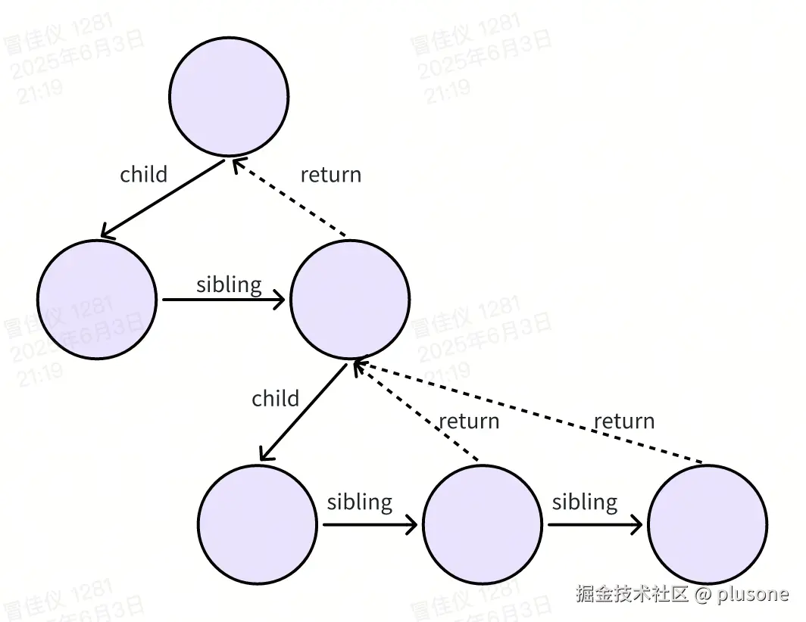
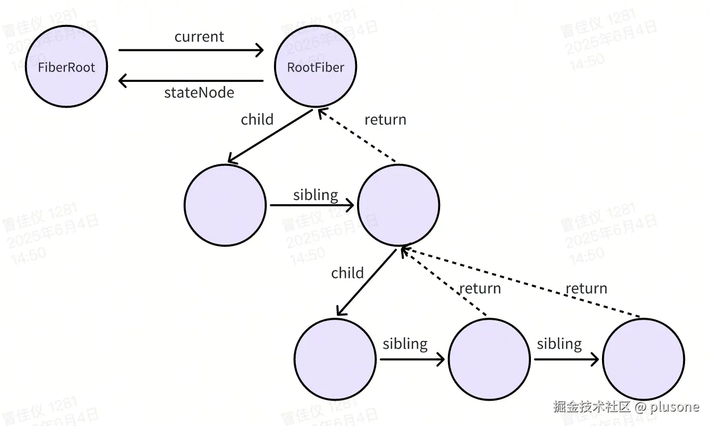

[上一篇文章](url)中，我们提到 React 16 版本开始引入 Fiber 架构，为 React 18 的并发渲染（Concurrent Rendering）打下基础。那么 Fiber 是什么？并发渲染又是什么呢？

# React 16 之前的性能瓶颈

要理解 Fiber，首先我们先来看一看 React 16 之前的性能瓶颈，大概有两种场景：

**1. 执行大量计算时，页面会卡帧、掉帧。**

我们知道，React 中存在**虚拟 DOM**的概念，更新时会对前后虚拟 DOM 进行 diff，最终在真实 DOM 上仅操作 diff 部分以节省开销。但 React 16 之前，进行两棵虚拟 DOM 树的对比时，使用栈式递归，且这种递归**不能打断**，则可能造成一帧中 React 执行时间过长，页面卡顿。

所以，理想情况下我们希望在每一帧中尽量留下更多的时间给浏览器，比如希望达到 60 帧率，即一帧 16.6ms，那么可以 React 任务执行 10ms，剩下 6ms 给浏览器。

解决这个问题的思路是**时间切片**，即把一个大任务拆成多个小任务，分散在多个帧中完成。每个帧中时间到了，就把执行权交还给浏览器，下次浏览器空闲时间再继续执行。**这就要求 React 能够支持可中断的渲染，且下次能从中断的地方继续执行。**

**2. 复杂的 UI 交互时，页面响应卡顿。**

React 16 之前没有优先级概念，各种任务一视同仁地同步执行，这会让重要的任务延迟，导致体验差。

考虑到用户对不同操作卡顿的感知不一样，引入**优先级调度**可以解决这个问题。比如点击等交互类事件的优先级应该高于 `setState` 中的更新，高优先级的任务可以打断低优先级的任务。

> 总结一下，为解决 React 16 之前的性能瓶颈，几个关键诉求：**时间切片**、**可中断**、**基于优先级的调度**。

# Fiber

于是，Fiber 架构出现了，它是一种拆分任务实现时间切片的机制，也是一个数据结构。

## Fiber 数据结构

Fiber 是一棵链表结构的树，React 组件树中的一个组件或元素对应一个 Fiber Node，精简过后 Fiber Node 的核心数据结构如下：

```ts
export type Fiber = {
  tag: WorkTag;
  key: null | string;
  elementType: any;
  type: any;
  stateNode: any;
  alternate: Fiber | null;

  return: Fiber | null;
  child: Fiber | null;
  sibling: Fiber | null;

  pendingProps: any;
  memoizedProps: any;
  memoizedState: any;

  updateQueue: mixed;
  lanes: Lanes;
  childLanes: Lanes;

  nextEffect: Fiber | null;
  firstEffect: Fiber | null;
  lastEffect: Fiber | null;

  dependencies: Dependencies | null;
};
```

### 基础字段

- `tag`：表示 Fiber 的类型，如：`FunctionComponent`、`HostComponent`、`ClassComponent` 等。

- `key`：Fiber 节点的唯一标识。

- `elementType`：原始 JSX 中 `ReactElement` 的 `type` 字段。

- `type`：Fiber 实际要执行的函数/类组件体，可能已经解析过。

- `stateNode`：保存当前 Fiber 对应的实例或真实 DOM 节点。

- `alternate`：用于双缓存，React 更新过程中有两棵 Fiber 树，`current` 表示当前展示的树，`workInProgress` 表示内存中正在构建的新 Fiber 树，两棵 Fiber 树通过 `alternate` 属性相互指向。更新过程中，React 会复用并互换这两棵树，以节省内存开销，具体过程会在后续讲解。

### 链表结构字段

这三个字段串联了整个 Fiber 树的链表结构。

- `return`：指向父 Fiber。

- `child`：指向第一个子 Fiber。

- `sibling`：指向下一个兄弟 Fiber。

树结构类似于：



每个节点只会存它的第一个子节点，其他子节点通过 `sibling` 单向指向来存储，子节点都会通过 `return` 指向父节点。

### 状态记录字段

以下三个字段用于在 Fiber 节点上保存组件状态。

- `pendingProps`：本次更新传入的新 props。

- `memoizedProps`：上次渲染过程中旧的 props。

- `memoizedState`：当前组件保存的最新状态，比如在类组件中是 `this.state` 的值，在函数组件中是 hooks 的链表头。

### 更新相关字段

- `updateQueue`：存储当前 Fiber 节点对应组件的更新队列，即 `setState` 产生的状态更新，用于计算 `memoizedState`。

- `lanes`：当前 Fiber 节点自身的更新优先级。

- `childLanes`：当前 Fiber 节点所有子节点的更新优先级。

### 副作用相关字段

- `nextEffect`、`firstEffect`、`lastEffect`：单向链表结构，用于构建副作用链，供 commit 阶段执行。

### 其他字段

- `dependencies`：当前 Fiber 节点所依赖的 context，用于感知 context 的变化是否影响组件。

> 此处仅简单描述这些字段的作用，留有很多细节没有展开，在后续的源码分析中遇到时会再详细解释。

## FiberRootNode

我们知道，整个应用可以被描述为一棵 Fiber 树，`FiberRootNode` 就是这棵 Fiber 树的起点。

### 和 Fiber 的关系

值得注意的是，**FiberRoot 和 RootFiber 并不是一个东西**。RootFiber 是最根部的一个 Fiber 节点，而 FiberRoot 并不是 Fiber。二者之间可以通过指针互相指向：

- `FiberRootNode.current`：指向 RootFiber。

- `RootFiber.stateNode`：指回 FiberRoot。



### 属性

`FiberRootNode` 作为整个应用的起点，包含很多重要信息，比如：

#### 指针

- `current`：上面提到过，指向 RootFiber。

#### 容器信息

- `containerInfo`：React 渲染的目标容器，比如一个 DOM 节点。

#### 调度状态

- `pendingLanes`：当前所有待处理的更新。

- `expiredLanes`：过期的更新，需要尽快处理。

还有很多各种阶段的 Lane 状态，此处不一一列举。至于 Lanes 是什么，后续会讲到。

#### 调度任务和优先级

- `callbackNode`：Scheduler 的 callback，当前调度的任务。
- `callbackPriority`：当前调度的任务对应的优先级。

## Fiber 的作用

使用链表结构的 Fiber 树的最大好处是，进行整棵树的对比时，过程**可中断**。只要记录中断时的 Fiber Node，下次从中断处根据其 `return`、`child`、`sibling` 指针继续执行即可。

# Scheduler

在 Fiber 架构的基础上，React 还引入了另一个重要模块 Scheduler 调度器，二者配合可实现以下目标：

- **时间切片**：将大任务拆分为小任务，在浏览器空闲时间执行。
- **基于优先级的任务调度**。
- **可中断的更新**：高优先级任务打断低优先级任务。

也就是真正的**并发渲染（Concurrent Rendering）**。

Scheduler 基于优先级的调度一定离不开优先级模型，React 中的优先级有 **Scheduler 优先级**和**事件优先级**。

## Scheduler 优先级（SchedulerPriorityLevel）

scheduler 是 React 项目 monorepo 中一个可以独立发布的包，其中维护 5 种任务优先级，值为常量 1-5，优先级由高到低。

| Scheduler 优先级       | 值  | 含义                           |
| ---------------------- | --- | ------------------------------ |
| `ImmediatePriority`    | 1   | 立即执行任务（同步）           |
| `UserBlockingPriority` | 2   | 用户阻塞（点击、输入）         |
| `NormalPriority`       | 3   | 默认                           |
| `LowPriority`          | 4   | 次要任务                       |
| `IdlePriority`         | 5   | 空闲时运行（预加载、预渲染等） |

## 事件优先级（EventPriority）

React 中不同交互事件产生的更新会有不同优先级，即事件优先级。React 内部有 4 种事件优先级，对应不同的 **Lane 值**，优先级由高到低。这里提到的 Lane 是 React 内部一个更细粒度的优先级模型。

| 事件优先级                | 值                    | 含义                                       |
| ------------------------- | --------------------- | ------------------------------------------ |
| `DiscreteEventPriority`   | `SyncLane`            | 离散事件优先级，例如 `click`, `keydown`    |
| `ContinuousEventPriority` | `InputContinuousLane` | 连续事件优先级，例如 `mousemove`, `scroll` |
| `DefaultEventPriority`    | `DefaultLane`         | 默认事件优先级                             |
| `IdleEventPriority`       | `IdleLane`            | 闲置事件优先级                             |

Scheduler 优先级和事件优先级之间可以相互转换。

## 优先级模型

React 在优先级表达方式上经过了两次迭代：**expirationTime 模型**和 **Lane 模型**。

### expirationTime 模型

React 16 使用的优先级模型。使用一个以毫秒为单位的时间戳来表示任务的优先级和过期时间。它是一个整数，数字越小，表示任务越早过期，优先级越高。

每次更新，expirationTime 由触发时间和事件优先级对应的延迟时间计算得到。

#### 问题

**1. 表达「批次」时不够灵活**

需要通过时间窗。即，给同一个时间窗口内的多个更新分配相同的 expirationTime，于是它们被认为是“同一批”。这意味着，落在同一时间窗内的更新一定是同一批，而跨时间窗的就无法合并。

- 比如两个组件的更新间隔了 5ms，却因为跨过了不同的时间窗，就不能合批了。

- 反之，时间窗太大又会导致过多的合并，牺牲响应性。

**2. 语义不够清晰**

expirationTime 只能用数字的大小来比较优先级。如果两个任务的 expirationTime 相等，React 无法再进一步区分它们的语义。

### Lane 模型

React 18 引入。用一个 31 位的 **位掩码（bitmask）** 来表示最多 31 种更新优先级。比如：

| 名称                  | 二进制 Lane 值           |
| --------------------- | ------------------------ |
| `SyncLane`            | `0b000000...00000000001` |
| `InputContinuousLane` | `0b000000...00000000010` |
| `DefaultLane`         | `0b000000...00000000100` |
| `IdleLane`            | `0b100000...00000000000` |

Lane 是用于表达一种类型任务的位掩码，即二进制数中只有一位为 1，1 的位置越靠右表示优先级越高。

而 Lanes 是用于表达一批任务的位掩码，即二进制数中可以有多位为 1。

#### 优点

对比 expirationTime 模型，Lane 模型的优点有：

**1. 更灵活的表达批**

Lane 模型可以方便的用一个有多个位为 1 的位掩码来表示批，比如：

```ts
const batch = 0b0000111011111;
```

想判断某个任务是不是属于这个批，只需要通过位运算：

```ts
(task & batch) !== 0;
```

**2. 语义清晰**

每类任务有独立 Lane。

**3. 内存占用小**

表示多个优先级，expirationTime 模型需要多个十进制数来表示，Lane 模型只需要一个二进制数。

**4. 运算效率高**

位运算的效率高于普通的算数运算。

> 当前，React 的优先级模型已由 expirationTime 模型转为 Lane 模型。

> 每次更新时，表示此次更新优先级的 Lane 值会被记录在 fiber 节点上，即 `fiber.lanes` 和 `fiber.childLanes` 字段。

# 总结

本文介绍了 React 实现中的几个核心点：

- Fiber 架构：数据结构和解决的问题
- Scheduler 调度器
- Lane 优先级模型

看到这里，仅对 React 的整体思路有一个认知，还留有很多疑问，比如如何实现时间切片（把大任务分到各个帧中执行）、如何按照优先级调度等，后续的文章中会一一解答。
