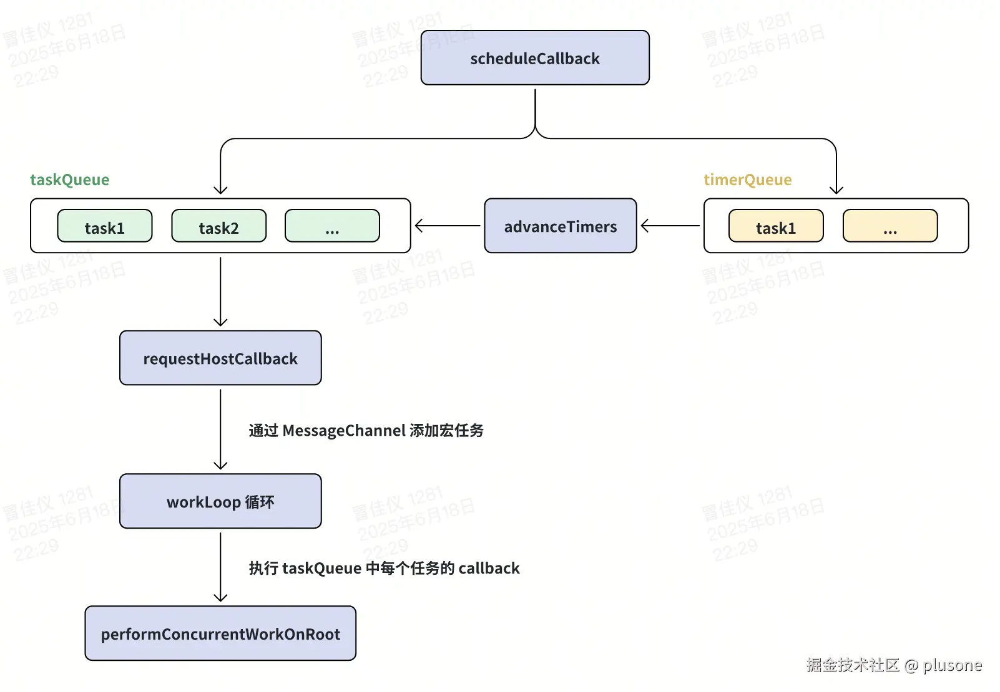
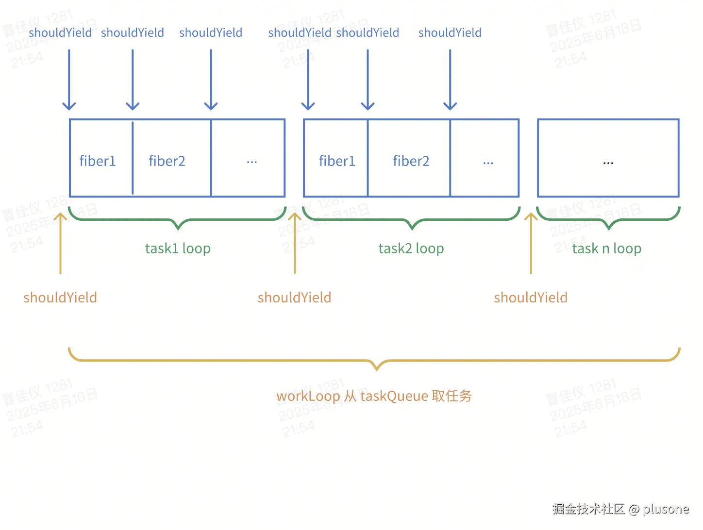

> [上一章](url)介绍了 React 中初次渲染和 `setState` 创建更新到触发调度的流程。这章会从上一章最后提到的 `scheduleUpdateOnFiber` 方法开始详细分析 React 中的调度过程。

# scheduleUpdateOnFiber

调度更新的入口函数，比如 `setState` 使组件状态发生变化后，React 会通过 `scheduleUpdateOnFiber` 将更新任务加入调度系统，最终触发更新流程。

简化后的源码如下，有三个核心步骤。

```ts
export function scheduleUpdateOnFiber(
  fiber: Fiber,
  lane: Lane,
  eventTime: number
): FiberRoot | null {
  const root = markUpdateLaneFromFiberToRoot(fiber, lane);
  if (root === null) {
    return null;
  }

  markRootUpdated(root, lane, eventTime);

  ensureRootIsScheduled(root, eventTime);

  return root;
}
```

## markUpdateLaneFromFiberToRoot

为 Fiber 树上的节点记录更新。

```ts
function markUpdateLaneFromFiberToRoot(
  sourceFiber: Fiber,
  lane: Lane
): FiberRoot | null {
  sourceFiber.lanes = mergeLanes(sourceFiber.lanes, lane);
  let alternate = sourceFiber.alternate;
  if (alternate !== null) {
    alternate.lanes = mergeLanes(alternate.lanes, lane);
  }
  let node = sourceFiber;
  let parent = sourceFiber.return;
  while (parent !== null) {
    parent.childLanes = mergeLanes(parent.childLanes, lane);
    alternate = parent.alternate;
    if (alternate !== null) {
      alternate.childLanes = mergeLanes(alternate.childLanes, lane);
    }
    node = parent;
    parent = parent.return;
  }
  if (node.tag === HostRoot) {
    const root: FiberRoot = node.stateNode;
    return root;
  } else {
    return null;
  }
}
```

**参数**：

- `sourceFiber`：更新对应的 Fiber 节点。

- `lane`：更新的优先级。

**核心流程**：

1. 将当前更新的优先级 lane 通过**位运算**合并到当前更新的 Fiber 节点的 `fiber.lanes` 属性上。即，记录 Fiber 节点自身的更新优先级。

```ts
export function mergeLanes(a: Lanes | Lane, b: Lanes | Lane): Lanes {
  return a | b;
}
```

2. 通过 `fiber.return` 属性从当前 Fiber 节点向上遍历父节点，直到 RootFiber（`RootFiber.parent === null`），并沿途将当前更新的 lane 合并到每个父节点的 `childLanes` 属性上。即，一个节点更新优先级变化，它的父节点的 `childLanes` 会随之变化。

3. 最后从 `RootFiber.stateNode` 获取 FiberRoot（[之前](url)有讲过 `FiberRoot` 和 `RootFiber` 的关系），并返回 FiberRoot 供后续调度使用。

> 此处对 `fiber.lanes` 和沿途父节点 `parent.childLanes` 的标记，用于记录 Fiber 树上的各个节点是否需要更新。

## markRootUpdated

在 FiberRoot 上标记此次更新的优先级和优先级对应的时间戳。

```ts
export function markRootUpdated(
  root: FiberRoot,
  updateLane: Lane,
  eventTime: number
) {
  root.pendingLanes |= updateLane;

  if (updateLane !== IdleLane) {
    root.suspendedLanes = NoLanes;
    root.pingedLanes = NoLanes;
  }

  const eventTimes = root.eventTimes;
  const index = laneToIndex(updateLane);

  eventTimes[index] = eventTime;
}
```

**参数**：

- `root`：上一步返回的 FiberRoot。

- `updateLane`：更新的优先级。

- `eventTime`：更新任务的时间戳。

**核心流程**：

**1. 更新 `FiberRoot.pendingLanes`**

把当前更新的 lane 合并到 `FiberRoot.pendingLanes` 中。`FiberRoot.pendingLanes` 属性[之前](url)有讲过，表示当前所有待处理的更新。

**2. 清除挂起状态任务**

如果当前更新不是低优先级更新（[这里](url)可以回顾 Scheduler 的优先级，此处判断 `lane !== IdleLane`），则清除 `suspendedLanes` 挂起状态的任务 和 `pingedLanes` 恢复状态的任务。因为要重新开始新一轮调度了。

**3. 更新 `eventTimes`**

FiberRoot 上的 `eventTimes` 属性是一个长度为 31 位的数组，每个索引记录一个 lane 优先级最近一次事件发生的时间戳。这恰好对应 [Lane 模型](url)是一个 31 位的位掩码表示最多 31 种更新优先级。

```ts
root.eventTimes = [
  1670000000000,
  0,
  1670000001234,
  ...
]
```

`laneToIndex` 用于获取 lane 值在 `eventTimes` 数组中对应的索引，比如 `updateLane` 为 `0b000000000000000000010000`，即 lane 12，`laneToIndex(updateLane)` 会返回数字 12。

然后将此次更新任务的 `eventTime` 时间戳存到 `eventTimes` 数组对应的 lane 索引中。

> 这样做的目的是：记录某个 lane 优先级的更新是何时发生的，在之后的调度中，用于判断是否已经「等待太久」，需要抢占或提升优先级。

## ensureRootIsScheduled

React 中的“调度总管”，每次创建更新后，决定是否要进入调度、以何种方式（同步/异步）调度。

精简后的源码如下：

```ts
function ensureRootIsScheduled(root, currentTime) {
  const existingCallbackNode = root.callbackNode;

  markStarvedLanesAsExpired(root, currentTime);

  const nextLanes = getNextLanes(
    root,
    root === workInProgressRoot ? workInProgressRootRenderLanes : NoLanes
  );

  if (nextLanes === NoLanes) {
    if (existingCallbackNode !== null) {
      cancelCallback(existingCallbackNode);
    }
    root.callbackNode = null;
    root.callbackPriority = NoLane;
    return;
  }

  const newCallbackPriority = getHighestPriorityLane(nextLanes);

  const existingCallbackPriority = root.callbackPriority;

  if (existingCallbackPriority === newCallbackPriority) {
    return;
  }

  if (existingCallbackNode !== null) {
    cancelCallback(existingCallbackNode);
  }

  let newCallbackNode;

  if (newCallbackPriority === SyncLane) {
    scheduleSyncCallback(() => performSyncWorkOnRoot(root));
    scheduleMicrotask(() => flushSyncCallbacks());
    newCallbackNode = null;
  } else {
    let schedulerPriorityLevel;
    switch (lanesToEventPriority(nextLanes)) {
      case DiscreteEventPriority:
        schedulerPriorityLevel = ImmediateSchedulerPriority;
        break;
      case ContinuousEventPriority:
        schedulerPriorityLevel = UserBlockingSchedulerPriority;
        break;
      case DefaultEventPriority:
        schedulerPriorityLevel = NormalSchedulerPriority;
        break;
      case IdleEventPriority:
        schedulerPriorityLevel = IdleSchedulerPriority;
        break;
      default:
        schedulerPriorityLevel = NormalSchedulerPriority;
        break;
    }
    newCallbackNode = scheduleCallback(
      schedulerPriorityLevel,
      performConcurrentWorkOnRoot.bind(null, root)
    );
  }

  root.callbackPriority = newCallbackPriority;
  root.callbackNode = newCallbackNode;
}
```

**参数**：

- `root`：FiberRoot。

- `currentTime`：当前时间戳。

**核心逻辑**：

### markStarvedLanesAsExpired 处理饥饿问题

在调度过程中，某些任务可能因为高优任务插队而长期不能执行，产生「饥饿问题」，这个方法把等待时间太久的 lanes 标记为**过期**，强制尽快执行。

```ts
export function markStarvedLanesAsExpired(
  root: FiberRoot,
  currentTime: number
): void {
  const pendingLanes = root.pendingLanes;
  const suspendedLanes = root.suspendedLanes;
  const pingedLanes = root.pingedLanes;
  const expirationTimes = root.expirationTimes;

  let lanes = pendingLanes;
  while (lanes > 0) {
    const index = pickArbitraryLaneIndex(lanes);
    const lane = 1 << index;

    const expirationTime = expirationTimes[index];
    if (expirationTime === NoTimestamp) {
      if (
        (lane & suspendedLanes) === NoLanes ||
        (lane & pingedLanes) !== NoLanes
      ) {
        expirationTimes[index] = computeExpirationTime(lane, currentTime);
      }
    } else if (expirationTime <= currentTime) {
      root.expiredLanes |= lane;
    }

    lanes &= ~lane;
  }
}
```

**1. 从 FiberRoot 上获取 `pendingLanes`、`expirationTimes`**

`pendingLanes`：当前所有待处理任务优先级的集合。

`expirationTimes`：一个 31 位的数组，类似前面提到的 `eventTimes`，记录每个 lane 的过期时间。

**2. 遍历 `pendingLanes` 集合**

`pickArbitraryLaneIndex` 方法找到 lanes 中第一个 1 所在的 index。比如：

```ts
lanes = 0b00010110; // 有第 1、2、4 位任务在等待
index = pickArbitraryLaneIndex(lanes); // 返回 1
```

`const lane = 1 << index` 根据 index 还原 lane 值。比如：

```ts
lane = 1 << 1 = 0b00000010;
```

中间经过一系列处理，最后 `lanes &= ~lane`，去掉刚刚处理过的 lane 值，再开始下一轮循环。

比如第一轮循环 lanes 为 `0b00010110`，处理的 lane 为 `0b00000010`，进入下一轮循环的 lanes 为 `0b00010100`。

**3. 每一轮循环的处理**

通过本轮要处理的 lane 值对应的 index ，从 `root.expirationTimes` 上获取这个 lane 的过期时间。

如果这个 lane 没有设置过期时间，就计算一个过期时间，存放在 `root.expirationTimes` 中。

如果这个 lane 设置了过期时间，检查是否过期。如果已过期，则将当前 lane 值添加到 `root.expiredLanes` 上，表示这个 lane 在下一轮调度中会以同步模式渲染，不可中断（后续在 `performConcurrentWorkOnRoot` 中判断），避免任务饥饿问题。

### getNextLanes 挑选调度目标

从 `root.pendingLanes` 中挑出一批 Lane（任务），优先级最高、不被挂起的，作为调度的目标。

```ts
export function getNextLanes(root: FiberRoot, wipLanes: Lanes): Lanes {
  const pendingLanes = root.pendingLanes;
  if (pendingLanes === NoLanes) {
    return NoLanes;
  }

  let nextLanes = NoLanes;

  const suspendedLanes = root.suspendedLanes;
  const pingedLanes = root.pingedLanes;

  const nonIdlePendingLanes = pendingLanes & NonIdleLanes;
  if (nonIdlePendingLanes !== NoLanes) {
    const nonIdleUnblockedLanes = nonIdlePendingLanes & ~suspendedLanes;
    if (nonIdleUnblockedLanes !== NoLanes) {
      nextLanes = getHighestPriorityLanes(nonIdleUnblockedLanes);
    } else {
      const nonIdlePingedLanes = nonIdlePendingLanes & pingedLanes;
      if (nonIdlePingedLanes !== NoLanes) {
        nextLanes = getHighestPriorityLanes(nonIdlePingedLanes);
      }
    }
  } else {
    const unblockedLanes = pendingLanes & ~suspendedLanes;
    if (unblockedLanes !== NoLanes) {
      nextLanes = getHighestPriorityLanes(unblockedLanes);
    } else {
      if (pingedLanes !== NoLanes) {
        nextLanes = getHighestPriorityLanes(pingedLanes);
      }
    }
  }

  if (nextLanes === NoLanes) {
    return NoLanes;
  }

  if (
    wipLanes !== NoLanes &&
    wipLanes !== nextLanes &&
    (wipLanes & suspendedLanes) === NoLanes
  ) {
    const nextLane = getHighestPriorityLane(nextLanes);
    const wipLane = getHighestPriorityLane(wipLanes);
    if (
      nextLane >= wipLane ||
      (nextLane === DefaultLane && (wipLane & TransitionLanes) !== NoLanes)
    ) {
      return wipLanes;
    }
  }

  return nextLanes;
}
```

**参数**：

- `root`：FiberRoot。

- `wipLanes`：当前正在进行渲染中的 lanes，用于避**重新进入已在进行中的任务**，导致的重复调度。

```ts
root === workInProgressRoot ? workInProgressRootRenderLanes : NoLanes;
```

**逻辑**：

1. 获取所有待处理的任务，没有则直接返回 `NoLanes`。

2. 优先调度非 Idle 任务（低优空闲任务），从非 `IdleLanes` 中找：

- 非 suspense 任务（挂起任务）中优先级最高的。
- 找不到，则找从 suspense 状态被恢复的任务（pinged）。

3. 从 `IdleLanes` 中找：

- 非 suspense 任务（挂起任务）中优先级最高的。
- 找不到，则找从 suspense 状态被恢复的任务（pinged）。

4. 依然找不到，返回 `NoLanes`。

5. 避免打断正在 render 中的任务（`wipLanes`）：如果下一批 lanes 完全被当前正在执行的任务包含，那就返回 `wipLanes` 继续当前的工作，目的是减少 render 被打断造成的浪费。

6. 最终返回找到的 `nextLanes`。

### 没有要执行的任务则取消之前设置的调度任务

`existingCallbackNode` 是指 **当前已经在调度器中注册的任务** ，它来自 `FiberRoot.callbackNode`，用来跟踪该 FiberRoot 上已经设置的调度任务。

React 在某次 `getNextLanes()` 的结果是 `NoLanes`，意味着当前 Fiber 树中没有任何更新需要处理，那就可以取消之前设置的调度任务。

### getHighestPriorityLane

从一组 lanes 中，找出优先级最高的那个 lane。

```ts
export function getHighestPriorityLane(lanes: Lanes): Lane {
  return lanes & -lanes;
}
```

核心就是一行位运算，返回最低位 1 的那个 lane（位越低，优先级越高）。

### 新旧任务优先级相同跳过调度

```ts
// 如果已有 callback，且优先级不变，不需要重新调度
const existingCallbackPriority = root.callbackPriority;
if (existingCallbackPriority === newCallbackPriority) {
  return;
}
```

比较「旧的任务」和「新的任务」的优先级，如果两者相同，则 `return` 跳过调度，复用之前的 callback 即可。

### 新旧任务优先级不同则取消旧任务

```ts
if (existingCallbackNode !== null) {
  cancelCallback(existingCallbackNode);
}
```

### 根据优先级决定以同步或异步方式调度任务

`newCallbackPriority` 是 `getHighestPriorityLane()` 返回的当前 `root.pendingLanes` 上最高优先级的 lane。

#### 同步调度

如果最高优先级的 lane 是 `SyncLane` 则同步执行。

```ts
scheduleSyncCallback(() => performSyncWorkOnRoot(root));
scheduleMicrotask(() => flushSyncCallbacks());
```

#### 异步调度

否则走 Scheduler 调度系统进行异步调度。

先把 React 的 lane 优先级转为 Scheduler 优先级，这两个优先级之前有介绍过：[Scheduler 优先级和事件优先级](url)。

然后调用 `scheduleCallback`，传入 `performConcurrentWorkOnRoot` 作为回调，后面会详细讲它们的实现。

```ts
newCallbackNode = scheduleCallback(
  schedulerPriorityLevel,
  performConcurrentWorkOnRoot.bind(null, root)
);
```

### 缓存当前调度任务和它的优先级

```ts
root.callbackPriority = newCallbackPriority;
root.callbackNode = newCallbackNode;
```

`newCallbackNode` 为当前调度任务，`newCallbackPriority` 为当前 `root.pendingLanes` 上最高优先级，也是当前调度任务的优先级。

缓存它们的作用是：下次 `ensureRootIsScheduled()` 执行时可以比较新旧任务优先级，优先级相同则跳过调度，否则取消旧任务重新调度。

# 同步调度流程

```ts
scheduleSyncCallback(() => performSyncWorkOnRoot(root));
scheduleMicrotask(() => flushSyncCallbacks());
```

## scheduleSyncCallback

将回调（`performSyncWorkOnRoot()`）放入同步队列 `syncQueue` 中。

```ts
let syncQueue = null;

export function scheduleSyncCallback(callback) {
  if (syncQueue === null) {
    syncQueue = [callback];
  } else {
    syncQueue.push(callback);
  }
}
```

## scheduleMicrotask

一个跨平台封装，`queueMicrotask` -> `Promise` -> `setTimeout` 逐步降级，用于在当前调用栈执行完之后，安排一个微任务，在本轮事件循环尾部尽快执行。此处安排执行 `flushSyncCallbacks()`。

```ts
export const scheduleMicrotask =
  typeof queueMicrotask === "function"
    ? queueMicrotask
    : typeof Promise !== "undefined"
    ? (callback) => Promise.resolve(null).then(callback)
    : setTimeout;
```

> 同步任务不直接执行，而是用微任务包一层的原因：
>
> 1. 避免嵌套执行引发不一致或死循环
>    比如在 `render` 里调用 `flushSync()`，需要先等当前逻辑结束。
> 2. 收集多个 `flushSyncCallbacks()` 在微任务中统一批量处理，避免多次重渲染。

## flushSyncCallbacks

遍历 `syncQueue` ，其中每一项是一个 callback，逐个执行。即，执行 `performSyncWorkOnRoot()`。

```ts
export function flushSyncCallbacks() {
  if (syncQueue !== null) {
    const queue = syncQueue;
    syncQueue = null;

    for (let i = 0; i < queue.length; i++) {
      const callback = queue[i];
      callback(); // 执行传入的 performSyncWorkOnRoot(root)
    }
  }
}
```

## performSyncWorkOnRoot

其中调用 `renderRootSync` + `commitRoot`，`renderRootSync` 过程不可中断。

```ts
function performSyncWorkOnRoot(root) {
  renderRootSync(root);
  commitRoot(root);
}
```

# 异步调度流程

```ts
newCallbackNode = scheduleCallback(
  schedulerPriorityLevel,
  performConcurrentWorkOnRoot.bind(null, root)
);
```

## scheduleCallback

位于 Scheduler 包中，用于将一个任务调度到合适的优先级队列中，在浏览器空闲时间立即执行或延迟到指定时间后执行。

```ts
function scheduleCallback(priorityLevel, callback, options) {
  var currentTime = getCurrentTime();

  var startTime;
  if (typeof options === "object" && options !== null) {
    var delay = options.delay;
    if (typeof delay === "number" && delay > 0) {
      startTime = currentTime + delay;
    } else {
      startTime = currentTime;
    }
  } else {
    startTime = currentTime;
  }

  var timeout;
  switch (priorityLevel) {
    case ImmediatePriority:
      timeout = IMMEDIATE_PRIORITY_TIMEOUT;
      break;
    case UserBlockingPriority:
      timeout = USER_BLOCKING_PRIORITY_TIMEOUT;
      break;
    case IdlePriority:
      timeout = IDLE_PRIORITY_TIMEOUT;
      break;
    case LowPriority:
      timeout = LOW_PRIORITY_TIMEOUT;
      break;
    case NormalPriority:
    default:
      timeout = NORMAL_PRIORITY_TIMEOUT;
      break;
  }

  var expirationTime = startTime + timeout;

  var newTask = {
    id: taskIdCounter++,
    callback,
    priorityLevel,
    startTime,
    expirationTime,
    sortIndex: -1,
  };
  if (enableProfiling) {
    newTask.isQueued = false;
  }

  if (startTime > currentTime) {
    newTask.sortIndex = startTime;
    push(timerQueue, newTask);
    if (peek(taskQueue) === null && newTask === peek(timerQueue)) {
      if (isHostTimeoutScheduled) {
        cancelHostTimeout();
      } else {
        isHostTimeoutScheduled = true;
      }
      requestHostTimeout(handleTimeout, startTime - currentTime);
    }
  } else {
    newTask.sortIndex = expirationTime;
    push(taskQueue, newTask);
    if (enableProfiling) {
      markTaskStart(newTask, currentTime);
      newTask.isQueued = true;
    }
    if (!isHostCallbackScheduled && !isPerformingWork) {
      isHostCallbackScheduled = true;
      requestHostCallback(flushWork);
    }
  }

  return newTask;
}
```

**参数**：

- `priorityLevel`：任务的 scheduler 优先级。
- `callback`：要调度执行的任务函数，这里是 `performConcurrentWorkOnRoot`。
- `options`: 可选对象，包含 `delay`（延迟时间）字段。

**核心流程**：

### 确定任务开始时间

`currentTime` 为当前时间戳，根据参数中是否传了 `delay` 分为普通任务和延时任务：

- 普通任务：`startTime` = `currentTime`

- 延时任务：`startTime` = `currentTime` + `delay`

即，普通任务立即开始，延时任务延时开始。

> 可以通过 `startTime` 和 `currentTime` 比较得到任务是否为延时任务。

### 根据优先级确定任务过期时间

根据任务优先级，映射到不同的 `timeout`：

```ts
IMMEDIATE_PRIORITY_TIMEOUT = -1;
USER_BLOCKING_PRIORITY_TIMEOUT = 250;
NORMAL_PRIORITY_TIMEOUT = 5000;
LOW_PRIORITY_TIMEOUT = 10000;
IDLE_PRIORITY_TIMEOUT = MAX_INT;
```

过期时间 `expirationTime` = `startTime` + `timeout`，**这是任务最晚必须执行的时间**。

### 构建任务对象

任务对象中各个字段的含义如下：

- `id`：全局递增 ID。
- `callback`：要调度执行的任务函数，`performConcurrentWorkOnRoot()`。
- `priorityLevel`：任务优先级
- `startTime`：任务开始时间。
- `expirationTime`：任务过期时间。
- `sortIndex`：排序字段。

### 将任务对象加入合适的任务队列

Scheduler 中有两个任务队列：`taskQueue` 和 `timerQueue`，都是用**最小堆**的数据结构存储。

- `taskQueue`：普通任务队列，按照 `expirationTime` 任务过期时间排序，过期时间越早则越靠前。
- `timerQueue`：延时任务队列，按照 `startTime` 任务开始时间排序，开始时间越早则越靠前。

#### 延时任务

如果 `startTime > currentTime` 即延时任务。

1. 标记任务对象的 `sortIndex` 为 `startTime`。

2. push 到 `timerQueue` 延时任务队列。

3. 如果此时 `taskQueue` 中没有任务，且当前任务是延时任务队列中最早的任务，则调用 `requestHostTimeout(handleTimeout, startTime - currentTime)`。

##### requestHostTimeout

通过 `setTimeout` 延迟到当前任务设定的时间再执行 callback，即 `handleTimeout`。

```ts
function requestHostTimeout(callback, ms) {
  taskTimeoutID = localSetTimeout(() => {
    callback(getCurrentTime());
  }, ms);
}
```

##### advanceTimers

`handleTimeout` 中先执行 `advanceTimers`。它的作用是把 `timerQueue` 中所有到达 `startTime` 的任务移动到 `taskQueue` 准备执行。

```ts
function advanceTimers(currentTime) {
  let timer = peek(timerQueue);
  while (timer !== null) {
    if (timer.callback === null) {
      pop(timerQueue);
    } else if (timer.startTime <= currentTime) {
      pop(timerQueue);
      timer.sortIndex = timer.expirationTime;
      push(taskQueue, timer);
      if (enableProfiling) {
        markTaskStart(timer, currentTime);
        timer.isQueued = true;
      }
    } else {
      return;
    }
    timer = peek(timerQueue);
  }
}
```

1. 循环从 `timerQueue` 中取堆顶。

2. 如果任务对象上的 `callback` 属性为 `null`，表示该任务被取消（外部代码调用了 `cancelCallback`），就从 `timerQueue` 中移除它，不需要放到 `taskQueue`。

3. 如果任务对象的延迟时间到了，就从 `timerQueue` 中弹出，设置 `sortIndex` 为 `expirationTime`（因为在 `taskQueue` 中要按这个字段排序），然后 push 到 `taskQueue` 准备执行。

##### handleTimeout

```ts
function handleTimeout(currentTime) {
  isHostTimeoutScheduled = false;
  advanceTimers(currentTime);

  if (!isHostCallbackScheduled) {
    if (peek(taskQueue) !== null) {
      isHostCallbackScheduled = true;
      requestHostCallback(flushWork);
    } else {
      const firstTimer = peek(timerQueue);
      if (firstTimer !== null) {
        requestHostTimeout(handleTimeout, firstTimer.startTime - currentTime);
      }
    }
  }
}
```

1. 调用 `advanceTimers` 把 `timerQueue` 中所有到达 `startTime` 的任务移动到 `taskQueue` 准备执行。

2. `taskQueue` 中有任务可执行，调用 `requestHostCallback(flushWork)` 在浏览器空闲时立即执行。

3. `taskQueue` 中没有任务可执行，但 `timerQueue` 中有延时任务等待，就取最早的延时任务，继续通过 `requestHostTimeout(handleTimeout, firstTimer.startTime - currentTime)` 延时到特定的时间再放入 `taskQueue` 执行。

> 也就是说，`timerQueue` 中的任务不会直接执行，都是到期以后移动到 `taskQueue` 中被执行的。

#### 普通任务

不满足 `startTime > currentTime` 则为普通任务：

1. 标记任务对象的 `sortIndex` 为 `expirationTime`。

2. push 到 `taskQueue` 普通任务队列。

3. 调用 `requestHostCallback(flushWork)` 在浏览器空闲时立即执行。

## requestHostCallback

注册宏任务，在浏览器事件循环的下一个空闲时间执行。

```ts
function requestHostCallback(callback) {
  scheduledHostCallback = callback;
  if (!isMessageLoopRunning) {
    isMessageLoopRunning = true;
    schedulePerformWorkUntilDeadline();
  }
}
```

```ts
let schedulePerformWorkUntilDeadline;
if (typeof localSetImmediate === "function") {
  schedulePerformWorkUntilDeadline = () => {
    localSetImmediate(performWorkUntilDeadline);
  };
} else if (typeof MessageChannel !== "undefined") {
  const channel = new MessageChannel();
  const port = channel.port2;
  channel.port1.onmessage = performWorkUntilDeadline;
  schedulePerformWorkUntilDeadline = () => {
    port.postMessage(null);
  };
} else {
  schedulePerformWorkUntilDeadline = () => {
    localSetTimeout(performWorkUntilDeadline, 0);
  };
}
```

1. 保存传入的 `flushWork` 到 `scheduledHostCallback` 后续使用。

2. `isMessageLoopRunning` 避免重复注册。

3. 通过 `setImmediate` -> `MessageChannel` -> `setTimeout` 逐步降级，将 `performWorkUntilDeadline` 注册到浏览器事件循环的宏任务中，在主线程空闲的时候执行。

### performWorkUntilDeadline

在主线程空闲时调用 `flushWork` ，以及判断 `taskQueue` 中是否还有任务并再次开启调度。

```ts
const performWorkUntilDeadline = () => {
  if (scheduledHostCallback !== null) {
    const currentTime = getCurrentTime();

    startTime = currentTime;
    const hasTimeRemaining = true;

    let hasMoreWork = true;
    try {
      hasMoreWork = scheduledHostCallback(hasTimeRemaining, currentTime);
    } finally {
      if (hasMoreWork) {
        schedulePerformWorkUntilDeadline();
      } else {
        isMessageLoopRunning = false;
        scheduledHostCallback = null;
      }
    }
  } else {
    isMessageLoopRunning = false;
  }
  needsPaint = false;
};
```

1. 调用 `scheduledHostCallback` 即 `flushWork`（前面将它保存在了这个变量上）。

2. `flushWork` 返回 `hasMoreWork` 为 `true` 则表示 `taskQueue` 中还有可执行的任务，则调用 `schedulePerformWorkUntilDeadline` 再次调度，在浏览器事件循环的下一个空闲时间执行；否则停止调度。

## flushWork

内部实现简化一下，其实就是调用 `workLoop`。

## workLoop

在主线程空闲时间，从 `taskQueue` 中取任务，真正执行。

```ts
function workLoop(hasTimeRemaining, initialTime) {
  let currentTime = initialTime;
  advanceTimers(currentTime);
  currentTask = peek(taskQueue);
  while (currentTask !== null) {
    if (
      currentTask.expirationTime > currentTime &&
      (!hasTimeRemaining || shouldYieldToHost())
    ) {
      break;
    }
    const callback = currentTask.callback;
    if (typeof callback === "function") {
      currentTask.callback = null;
      currentPriorityLevel = currentTask.priorityLevel;
      const didUserCallbackTimeout = currentTask.expirationTime <= currentTime;

      const continuationCallback = callback(didUserCallbackTimeout);
      currentTime = getCurrentTime();
      if (typeof continuationCallback === "function") {
        currentTask.callback = continuationCallback;
      } else {
        if (currentTask === peek(taskQueue)) {
          pop(taskQueue);
        }
      }
      advanceTimers(currentTime);
    } else {
      pop(taskQueue);
    }
    currentTask = peek(taskQueue);
  }
  if (currentTask !== null) {
    return true;
  } else {
    const firstTimer = peek(timerQueue);
    if (firstTimer !== null) {
      requestHostTimeout(handleTimeout, firstTimer.startTime - currentTime);
    }
    return false;
  }
}
```

**1. 调用 `advanceTimers` 把 `timerQueue` 中所有到期的任务推到 `taskQueue` 准备执行**

**2. 进入一个可中断的 `while` 循环**

从 `taskQueue` 堆顶取一个任务对象进入循环。

**3. 检查是否需要中断（React 时间切片的关键）**

> React 源码系列的第一篇文章（[这里](url)）就有讲过时间切片的思想，即把一个大任务拆成多个小任务，分散在多个帧中完成。每个帧中时间到了，就把执行权交还给浏览器，下次浏览器空闲时间再继续执行。
>
> 浏览器流畅的用户体验为 60 FPS，则一帧需要控制在 1000ms / 60 ≈ 16ms 内，这 16ms 中需要留足够的时间给浏览器，剩余时间留给 React 执行。React 团队根据经验值，给默认的时间片设置为 5ms，超过这个时间就会**中断**，把主线程控制权交还给浏览器，下一个时间片再执行。

来看这里中断的判断，需要同时满足 2 个条件：

- 当前任务还没过期（`currentTask.expirationTime > currentTime`）
- 时间片用完，即 `shouldYieldToHost` 为 `true`。

**4. 执行任务回调**

不中断则从任务对象 `task.callback` 上获取任务函数并执行，即执行 `performConcurrentWorkOnRoot`。

如果返回一个 `continuationCallback` 函数，表示任务未执行完成，将其赋值回 `task.callback` 上，下一个 `while` 循环继续执行。

否则将当前任务对象从 `taskQueue` 中移除，下次循环从剩余的 `taskQueue` 中取堆顶执行。

**5. 准备下一轮循环**

再次把 `timerQueue` 中所有到期的任务推到 `taskQueue`，然后从 `taskQueue` 堆顶取一个任务对象进入下一轮循环。

## performConcurrentWorkOnRoot

其中调用 `renderRootConcurrent` + `commitRoot`，`renderRootConcurrent` 过程可中断。

```ts
function performConcurrentWorkOnRoot(root, didTimeout) {
  const originalCallbackNode = root.callbackNode;

  const lanes = getNextLanes(root, root === workInProgressRoot ? workInProgressRootRenderLanes : NoLanes);
  if (lanes === NoLanes) {
    return null;
  }

  const shouldTimeSlice = !includesExpiredLane(root, lanes) &&
  const exitStatus = shouldTimeSlice
    ? renderRootConcurrent(root, lanes)
    : renderRootSync(root, lanes);

  if (exitStatus !== RootInProgress) {
    finishConcurrentRender(root, exitStatus, lanes);
  }

  if (root.callbackNode === originalCallbackNode) {
    return performConcurrentWorkOnRoot.bind(null, root);
  }

  return null;
}
```

**1. 判断是否要进行可中断的渲染**

前面提到，`root.expiredLanes` 上记录了已经过期的更新任务对应的 lane 集合。这里通过 `includesExpiredLane` 比较要执行的 lanes 和 `root.expiredLanes`。如果要执行的任务已过期，则后续只能不可中断渲染（`renderRootSync`），否则可以进入可中断渲染流程。

**2. 调用 `renderRootConcurrent` 可中断渲染**

看下简化后的源码：

```ts
function renderRootConcurrent(root, lanes) {
  prepareFreshStack(root, lanes);
  do {
    try {
      workLoopConcurrent();
      break;
    } catch (thrownValue) {
      handleError(root, thrownValue);
    }
  } while (true);
  if (workInProgress !== null) {
    return RootInProgress;
  } else {
    workInProgressRoot = null;
    workInProgressRootRenderLanes = NoLanes;
    return workInProgressRootExitStatus;
  }
}
```

```ts
function workLoopConcurrent() {
  while (workInProgress !== null && !shouldYield()) {
    performUnitOfWork(workInProgress);
  }
}
```

`workLoopConcurrent` 中可以通过 `shouldYield` 中断。

中断时如果 `workInProgress` 不为 `null`，即这个任务还未完成，`renderRootConcurrent` 就返回 `RootInProgress`。

**3. 任务已完成调用 `commitRoot`**

`renderRootConcurrent` 返回的不是 `RootInProgress`，则该任务已完成，调用 `finishConcurrentRender`，其中调用 `commitRoot`。

**4. 任务未完成返回 `continuationCallback` 函数**

`renderRootConcurrent` 返回 `RootInProgress`，则该任务未完成，返回 `performConcurrentWorkOnRoot` 本身，即前面提到的 `continuationCallback` 函数，调度系统会在下一个时间片继续执行。

---

> 异步调度的整体流程图如下：



# 总结

本文分析了 React 中的核心调度流程，其中有几个核心点：

**1. 时间切片 + 可中断**

通过 `MessageChannel` 添加宏任务，实现异步任务在浏览器空闲时间执行。

执行任务的 `while` 循环中 `shouldYield` 控制中断，实现到达时间片就将控制权交还给浏览器。

可中断的节点有：



- 从 `taskQueue` 中每次取任务开始执行前。
- 每个任务的 `renderRoot` 中对单个 Fiber 节点的更新前。

**2. 基于优先级的调度**

优先级的概念贯穿整个调度过程。基于优先级可以实现：

- 每次都挑选最高优先级进行调度。

- 新旧任务优先级相同则复用之前的调度。

- 根据优先级确定同步/异步调度。

- 异步调度时，`taskQueue` 队列中任务的排序与任务开始时间和任务优先级相关，越早越先执行。

- `shouldYield` 中断后，如果有新的高优任务进来，下一帧中会优先执行，即高优任务打断低优任务。
