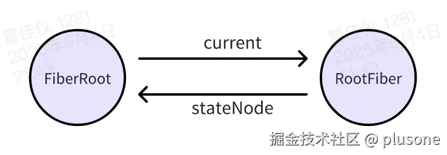
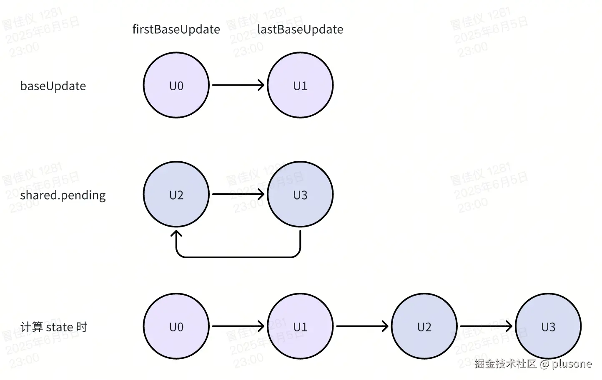
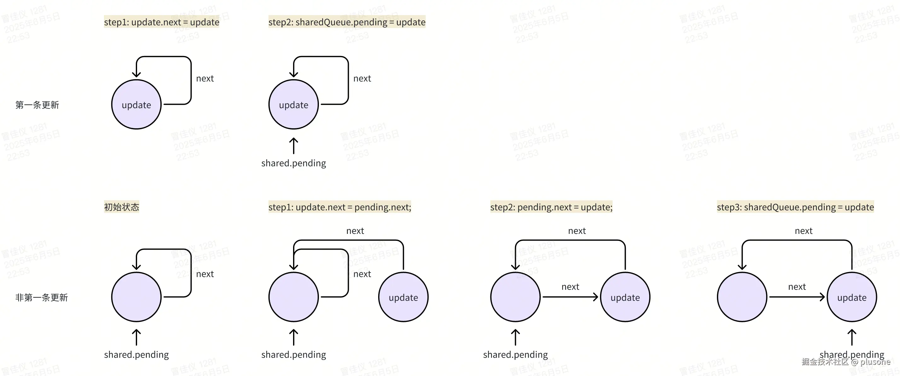

> [上一章](url)从整体架构层面介绍了 React 的实现思路，从这章开始，会实际进入源码层面的解析。文中展示的代码片段会在实际源码基础上进行精简，去除 dev 等逻辑，仅保留核心部分，便于理解。

---

React 中创建更新并触发调度有两种常见方式：

- 入口文件中 `ReactDOM.createRoot` + `root.render` 触发初次渲染。
- `setState` 触发更新渲染。

这两个流程其实有很多重合之处，我们一一来看。

# 初次渲染

一般来说，写 React 项目时，会有一个入口文件，文件内容大概长这样：

```ts
import ReactDOM from "react-dom/client";

import { App } from "./App";

const rootElement = document.getElementById("root") as HTMLElement;

const root = ReactDOM.createRoot(rootElement);

root.render(<App />);
```

- `ReactDOM.createRoot` 是 React 18 引入的新 API，用于启用并发渲染新特性，代替 React 17 以及之前的 `ReactDOM.render`。

- `root.render` 渲染 `App` 根组件，进行初次挂载。

## createRoot

跟踪调用链，最终 `createRoot` 实际做了两件事：

1. `createContainer`：初始化 Fiber 树。

2. `new ReactDOMRoot()`：返回 `ReactDOMRoot` 实例，暴露 `render` 方法触发更新。

```ts
// packages/react-dom/client.js
export function createRoot(
  container: Element | DocumentFragment,
  options?: CreateRootOptions
): RootType {
  try {
    return createRootImpl(container, options);
  } finally {
  }
}
```

```ts
// packages/react-dom/src/client/ReactDOM.js
function createRoot(container, options) {
  const root = createContainer(container, ConcurrentRoot, options);
  return new ReactDOMRoot(root);
}
```

顺便提一下，React 17 及之前的 `ReactDOM.render` API 的实现同样是调用 `createContainer`，区别是一个传入 `ConcurrentRoot`，一个传入 `LegacyRoot`，创建不同模式的 `FiberRootNode`。

```ts
export const LegacyRoot = 0;
export const ConcurrentRoot = 1;
```

### createContainer

用于初始化 Fiber 树。

```ts
// packages/react-reconciler/src/ReactFiberReconciler.js
export function createContainer(containerInfo, tag, options) {
  const hydrationCallbacks = null;
  return createFiberRoot(containerInfo, tag, hydrationCallbacks, options);
}
```

**参数**：

- `containerInfo`：React 渲染的目标容器，如 `<div id="root">`。

- `tag`：要创建的 FiberRoot 的类型，`ConcurrentRoot` 或 `LegacyRoot`。

**逻辑**：

直接调用 `createFiberRoot`。

#### createFiberRoot

创建 FiberRoot，创建并挂载 RootFiber 节点。

```ts
function createFiberRoot(containerInfo, tag, hydrationCallbacks, options) {
  const root = new FiberRootNode(containerInfo, tag, hydrationCallbacks);
  const uninitializedFiber = createHostRootFiber(tag);

  root.current = uninitializedFiber;
  uninitializedFiber.stateNode = root;

  initializeUpdateQueue(uninitializedFiber);

  return root;
}
```

**逻辑**：

1. 创建 `FiberRootNode` 作为应用的起点，`FiberRootNode` 是什么见[这里](url)。

2. 创建根 Fiber 节点，调用链：`createHostRootFiber` -> `createFiber`。Fiber 节点的数据结构见[这里](url)。

```ts
const createFiber = function (
  tag: WorkTag,
  pendingProps: mixed,
  key: null | string,
  mode: TypeOfMode
): Fiber {
  return new FiberNode(tag, pendingProps, key, mode);
};
```

3. 建立 FiberRoot 和 RootFiber 的双向关联。



4. 初始化根 Fiber 的更新队列。
   每个 Fiber 节点都有一个 `updateQueue` 属性，用于存储即将执行的更新，此处给根节点初始化一个空的更新队列。

```ts
export function initializeUpdateQueue<State>(fiber: Fiber): void {
  const queue: UpdateQueue<State> = {
    baseState: fiber.memoizedState,
    firstBaseUpdate: null,
    lastBaseUpdate: null,
    shared: {
      pending: null,
      interleaved: null,
      lanes: NoLanes,
    },
    effects: null,
  };
  fiber.updateQueue = queue;
}
```

5. 返回创建好的 FiberRoot，包含调度信息和根 Fiber，供后续 `render` 函数使用。

### new ReactDOMRoot()

创建了一个 `ReactDOMRoot` 实例，实现非常简单，只是将 `createContainer`（也就是 `createFiberRoot`）返回的 `FiberRootNode` 赋值给实例的 `_internalRoot` 属性。

```ts
function ReactDOMRoot(internalRoot) {
  this._internalRoot = internalRoot;
}
```

`ReactDOMRoot` 上暴露 `render` 方法，就是 React 项目入口文件中调用的 `root.render(<App />)`。下面来看下 `render` 方法的实现。

## root.render

用于触发更新流程。

```ts
ReactDOMRoot.prototype.render = function (children) {
  const root = this._internalRoot;
  updateContainer(children, root, null, null);
};
```

**参数**：

用户传入的 React 根元素，比如 `<App />`。

**逻辑**：

从 `ReactDOMRoot` 实例的 `_internalRoot` 属性上获取 `FiberRootNode`，和 React 根元素一起传入 `updateContainer` 方法。

### updateContainer

负责调度 React Fiber 树的更新。

```ts
export function updateContainer(
  element: ReactNode,
  root: FiberRoot,
  parentComponent: any,
  callback?: Function
): Lane {
  const current = root.current;
  const eventTime = requestEventTime();
  const lane = requestUpdateLane(current);

  const update = createUpdate(eventTime, lane);
  update.payload = { element };
  if (callback) {
    update.callback = callback;
  }

  enqueueUpdate(current, update, lane);
  scheduleUpdateOnFiber(current, lane, eventTime);

  return lane;
}
```

**参数**：

- `element`：要渲染的 React 元素。

- `root`: `FiberRootNode`。

- `parentComponent`：上层组件，用于 context，首次渲染一般是 null。

- `callback`：更新完成后的回调。

**逻辑**：

1. 通过 `FiberRoot.current` 获取 RootFiber 节点。

2. `requestEventTime` 获取事件时间戳。

3. `requestUpdateLane` 获取本次更新的 Lane 优先级。

4. `createUpdate` 创建 Update 对象。

5. `enqueueUpdate` 将 Update 对象加入队列。

6. `scheduleUpdateOnFiber` 触发调度流程。

# setState

class 组件中用户调用 `setState` 进行更新，底层实际调用 `enqueueSetState`。

```ts
Component.prototype.setState = function (partialState, callback) {
  this.updater.enqueueSetState(this, partialState, callback, "setState");
};
```

## enqueueSetState

```ts
enqueueSetState(inst, payload, callback) {
  const fiber = getInstance(inst);
  const eventTime = requestEventTime();
  const lane = requestUpdateLane(fiber);

  const update = createUpdate(eventTime, lane);
  update.payload = payload;
  if (callback !== undefined && callback !== null) {
    update.callback = callback;
  }

  enqueueUpdate(fiber, update, lane);
  scheduleUpdateOnFiber(fiber, lane, eventTime);
},
```

**参数**：

- `inst`：类组件实例，即调用 `this.setState()` 的组件。

- `payload`：`this.setState()` 的参数，可以是一个对象 `{ count: 2 }`，也可以是一个函数 `(prevState, props) => ({ count: prevState.count + 1 })`。

- `callback`：更新完成后的回调。

**逻辑**：

1. 通过类组件实例获取对应的 Fiber 节点。

每个类组件实例在构造时就绑定了对应 Fiber，可以通过组件实例上的 `_reactInternals` 属性获取。

```ts
export function getInstance(key) {
  return key._reactInternals;
}
```

2. `requestEventTime` 获取事件时间戳。

3. `requestUpdateLane` 获取本次更新的 Lane 优先级。

4. `createUpdate` 创建 Update 对象。

5. `enqueueUpdate` 将 Update 对象加入队列。

6. `scheduleUpdateOnFiber` 触发调度流程。

可以看出，这个流程和 `updateContainer` 几乎一致。也就是，**无论是初次渲染，还是更新渲染，创建更新 -> 触发调度的逻辑是复用的**。

下面，我们来详细分析**创建更新并触发调度**的流程。

# 创建更新和触发调度

## 获取 Fiber 节点

无论是初次渲染还是 `setState` 更新，第一步都是获取更新对应的 Fiber 节点。对初次渲染来说，是获取 RootFiber；对 `setState` 来说，则是触发更新的类组件对应的 Fiber。

## requestEventTime

获取当前更新任务的时间戳，这个时间戳的作用：

1. 用于调度排序。
2. 用于多个更新的合并优化。

- 即，保证一个「事件处理周期」中发起的多个更新有相同的 `eventTime`，以便将这些更新合并处理和调度。
- 事件处理周期指的是浏览器事件循环的一次 tick，比如写在 `onClick`、`onChange`、`setTimeout(...)` 回调中的代码，下面例子中两个 `setState` 产生的更新就应该共享一个 `eventTime`。

```ts
button.onclick = () => {
  setStateA(1);
  setStateB(2);
};
```

下面看具体的代码实现：

```ts
export function requestEventTime() {
  if ((executionContext & (RenderContext | CommitContext)) !== NoContext) {
    return now();
  }
  if (currentEventTime !== NoTimestamp) {
    return currentEventTime;
  }
  currentEventTime = now();
  return currentEventTime;
}
```

**1. 如果当前处于 render / commit 阶段，直接返回当前时间戳。**

可以通过 React 内部维护的全局变量 `executionContext` 判断当前运行阶段。

| 值               | 含义                            |
| ---------------- | ------------------------------- |
| `NoContext`      | 还没有进入 render / commit 阶段 |
| `RenderContext`  | 处于 render 阶段                |
| `CommitContext`  | 处于 commit 阶段                |
| `BatchedContext` | 正在批量处理更新                |
| ...              | ...                             |

适用于已处于 render / commit 阶段又触发的更新的场景（比如在 render 时又调用了 `setState`）。

**2. 如果还没有进入 render / commit 阶段，且之前已经记录过 `currentEventTime`，就复用它。**

`currentEventTime` 是一个事件周期内，第一次调用 `requestEventTime()` 时记录的时间。**后续都复用这个时间，就可以做到一个「事件处理周期」中发起的多个更新有相同的 `eventTime`**。比如这俩 `setState` 就有相同的 `eventTime`。

```ts
button.onclick = () => {
  setStateA(1);
  setStateB(2);
};
```

**3. 如果没有 `currentEventTime`，即本事件周期内第一次调用，就记录当前时间戳到 `currentEventTime`，然后返回这个时间戳。**

`currentEventTime` 重置的时机：在 React 完成 render 和 commit 阶段之后。

## requestUpdateLane

计算此次更新的 Lane 优先级。

```ts
export function requestUpdateLane(fiber: Fiber): Lane {
  const mode = fiber.mode;
  if ((mode & ConcurrentMode) === NoMode) {
    return (SyncLane: Lane);
  } else if (
    !deferRenderPhaseUpdateToNextBatch &&
    (executionContext & RenderContext) !== NoContext &&
    workInProgressRootRenderLanes !== NoLanes
  ) {
    return pickArbitraryLane(workInProgressRootRenderLanes);
  }

  const isTransition = requestCurrentTransition() !== NoTransition;
  if (isTransition) {
    if (currentEventTransitionLane === NoLane) {
      currentEventTransitionLane = claimNextTransitionLane();
    }
    return currentEventTransitionLane;
  }

  const updateLane: Lane = (getCurrentUpdatePriority(): any);
  if (updateLane !== NoLane) {
    return updateLane;
  }

  const eventLane: Lane = (getCurrentEventPriority(): any);
  return eventLane;
}
```

**1. 同步模式直接返回 `SyncLane`，即最高优先级，更新立即执行。**

**2. render 阶段产生的更新特殊处理。**

判断符合条件：

- 当前处于 render 阶段（通过 `executionContext` 判断）。

- 且存在 `workInProgressRootRenderLanes`（`workInProgressRootRenderLanes` 是一个全局变量，记录当前 render 过程中被处理的所有更新优先级）。

则从当前正在渲染的 lanes（`workInProgressRootRenderLanes`）中挑出优先级最高的那个作为此次更新优先级。挑出最高优先级 lane 的方式是一个经典的位运算，`lanes & -lanes` 即从 lanes 中，挑出最低位的那个 1，其他位清零。

```ts
export function pickArbitraryLane(lanes: Lanes): Lane {
  return getHighestPriorityLane(lanes);
}

export function getHighestPriorityLane(lanes: Lanes): Lane {
  return lanes & -lanes;
}
```

**3. 处理 `startTransition` 包裹的更新。**

`startTransition` 触发的更新属于「过渡更新」，优先级较低。通过 `startTransition` 触发更新时会给 `ReactCurrentBatchConfig.transition` 全局变量赋值。此处调用 `requestCurrentTransition()` 如果能从 `ReactCurrentBatchConfig.transition` 上获取值，就可以判断为是 Transition 更新。

```ts
export function requestCurrentTransition(): Transition | null {
  return ReactCurrentBatchConfig.transition;
}
```

Transition 更新通过 `cliamNextTransitionLane()` 生成 lane：从 16 条 transition lane 里面依次取一条 lane，第一个 transition 任务就取 `TransitionLane1`，第二个 transition 任务就取 `TransitionLane2`...以此类推。当取到 `TransitionLane16` 之后，下一个 transition 任务又从 `TransitionLane1` 开始，如此往复循环。

```ts
let nextTransitionLane: Lane = TransitionLane1;
export function claimNextTransitionLane(): Lane {
  const lane = nextTransitionLane;
  nextTransitionLane <<= 1;
  if ((nextTransitionLane & TransitionLanes) === 0) {
    nextTransitionLane = TransitionLane1;
  }
  return lane;
}

const TransitionLane1: Lane = 0b0000000000000000000000001000000;
const TransitionLane2: Lane = 0b0000000000000000000000010000000;
const TransitionLane3: Lane = 0b0000000000000000000000100000000;
const TransitionLane4: Lane = 0b0000000000000000000001000000000;
const TransitionLane5: Lane = 0b0000000000000000000010000000000;
const TransitionLane6: Lane = 0b0000000000000000000100000000000;
const TransitionLane7: Lane = 0b0000000000000000001000000000000;
const TransitionLane8: Lane = 0b0000000000000000010000000000000;
const TransitionLane9: Lane = 0b0000000000000000100000000000000;
const TransitionLane10: Lane = 0b0000000000000001000000000000000;
const TransitionLane11: Lane = 0b0000000000000010000000000000000;
const TransitionLane12: Lane = 0b0000000000000100000000000000000;
const TransitionLane13: Lane = 0b0000000000001000000000000000000;
const TransitionLane14: Lane = 0b0000000000010000000000000000000;
const TransitionLane15: Lane = 0b0000000000100000000000000000000;
const TransitionLane16: Lane = 0b0000000001000000000000000000000;
```

**4. 处理 React 内部事件优先级。**

React 事件机制，会根据不同的事件得到不同的事件触发函数，其中调用 `setCurrentUpdatePriority()` 在 `currentUpdatePriority` 全局变量上设置不同优先级。

```ts
let currentUpdatePriority: EventPriority = NoLane;
export function setCurrentUpdatePriority(newPriority: EventPriority) {
  currentUpdatePriority = newPriority;
}
```

关于 `EventPriority` 有哪些值，之前的文章提到过：[事件优先级（EventPriority）](url)。

此处通过 `getCurrentUpdatePriority()` 获取 `currentUpdatePriority` 全局变量上设置的 lane 值，如果不为 `NoLane`，则直接使用。

```ts
export function getCurrentUpdatePriority(): EventPriority {
  return currentUpdatePriority;
}
```

**5. 前面都没有确定 lane，返回 DefaultEventPriority。**

比如 `setTimeout` 中触发的更新。

```ts
export function getCurrentEventPriority(): EventPriority {
  const currentEvent = currentUpdatePriority;

  if (currentEvent !== DefaultEventPriority) {
    // 当前上下文中已经设置了事件优先级，直接用它
    return currentEvent;
  }

  return DefaultEventPriority;
}
```

## createUpdate

创建 `Update` 更新对象。`Update` 对象是 React 内部用于描述一次状态更新的最小单元，它会形成更新链（`UpdateQueue`）被放在 Fiber 节点上，最终在 render 阶段以此计算新的 state。

```ts
export function createUpdate(eventTime: number, lane: Lane): Update<*> {
  const update: Update<*> = {
    eventTime,
    lane,

    tag: UpdateState,
    payload: null,
    callback: null,

    next: null,
  };
  return update;
}
```

**参数**：

- `eventTime`：更新任务的时间戳。

- `lane`：更新的优先级。

**逻辑**：

创建 `Update` 对象并返回，这个 `Update` 对象是后续 `UpdateQueue` 链表结构的一个节点。

### `Update` 结构

1. `eventTime`：更新任务的时间戳。

2. `lane`：更新的优先级。

3. `tag`：更新类型，决定处理更新时对 state 的操作方式。React 中存在几种更新类型：

- `UpdateState`：`this.setState` 触发，合并到现有 state。
- `ReplaceState`：`this.replaceState` 触发，替换原有 state。
- `ForceUpdate`：`this.forceUpdate` 触发，强制更新。
- `CaptureUpdate`：ErrorBoundary 组件捕获错误时触发。

4. `payload`：更新时传入的新值或函数，比如：

```ts
setState({ count: 1 }); // payload: { count: 1 }
setState((prev) => ({ count: prev.count + 1 })); // payload: function
```

`createUpdate` 中未设置，在创建后，直接 `update.payload = payload;` 在 `Update` 对象上赋值。

5. `callback`：用于设置可选回调函数，比如：

```ts
this.setState({ count: 1 }, () => {
  console.log("更新完成");
});
```

6. `next`：指向 `UpdateQueue` 链表结构中下一个 `Update` 节点的指针。初始创建时为 null，后续会在 `enqueueUpdate` 中串起来。

## enqueueUpdate

将 `Update` 对象添加到组件对应 Fiber 节点的 `updateQueue` 中。

### updateQueue 结构

```ts
type UpdateQueue<State> = {
  baseState: State;
  firstBaseUpdate: Update<State> | null;
  lastBaseUpdate: Update<State> | null;
  shared: {
    pending: Update<State> | null;
  };
  effects: Array<Update<State>> | null;
};
```

1. `baseState`：上一次计算完后的 state，计算新 state 的基础。

2. `firstBaseUpdate`：上次 render 没有处理完的 Update 链表的起点（比如被中断的更新）。

3. `lastBaseUpdate`：上次 render 没有处理完的 Update 链表的终点。

4. `shared.pending`：待处理的更新队列（环形链表），`enqueueUpdate` 会往这里添加新的更新。

5. `effects`：副作用，通常用于生命周期的处理。

后续计算 state 时，环状链表会被拼接在 `lastBaseUpdate` 后，举个例子：



---

**下面看 `enqueueUpdate` 的源码**：

```ts
export function enqueueUpdate<State>(
  fiber: Fiber,
  update: Update<State>,
  lane: Lane,
) {
  const updateQueue = fiber.updateQueue;
  if (updateQueue === null) {
    return;
  }

  const sharedQueue: SharedQueue<State> = (updateQueue: any).shared;

  const pending = sharedQueue.pending;
  if (pending === null) {
    update.next = update;
  } else {
    update.next = pending.next;
    pending.next = update;
  }
  sharedQueue.pending = update;
}
```

**参数**：

- `fiber`: 当前更新的组件对应的 Fiber 节点。

- `update`: `createUpdate` 创建的更新对象。

- `lane`: 当前更新的优先级。

**逻辑**：

**1. 获取当前 Fiber 节点的 `updateQueue`。**

初始为一个空的更新队列：

```ts
{
    baseState: fiber.memoizedState,
    firstBaseUpdate: null,
    lastBaseUpdate: null,
    shared: {
      pending: null,
      interleaved: null,
      lanes: NoLanes,
    },
    effects: null,
}
```

**2. 获取 `updateQueue.shared.pending` 环状链表。**

**3. 将 `Update` 对象插入到 `shared.pending` 中。**

- 如果 `shared.pending` 是 null，说明这是第一条更新，直接令 `update.next = update`，形成环状链表结构。

- 否则，将 `update.next` 指向 `shared.pending.next`，并将 `shared.pending.next` 指向 `update` ，保持环状结构。

- 最后更新 `shared.pending` 的指针，指向新插入的 `update` 节点。



## scheduleUpdateOnFiber

核心调度入口。

# 总结

本文从初次渲染和 `setState` 触发更新两个入口进入，解析了 React 创建更新和触发调度的流程。

主要过程包含这几个步骤：获取 Fiber 节点，获取更新任务时间戳，计算更新优先级，创建 `Upate` 对象，将 `Update` 对象插入 `fiber.updateQueue`，开启调度。

下一章开始会从 `scheduleUpdateOnFiber` 方法进入，解析 React 中任务调度的过程。

此外，本文仅讲述了类组件的创建更新，关于函数式组件创建更新的过程，以及其 `Update` 对象的结构其实会有所差别，这些也会在后续的文章中讲解。
