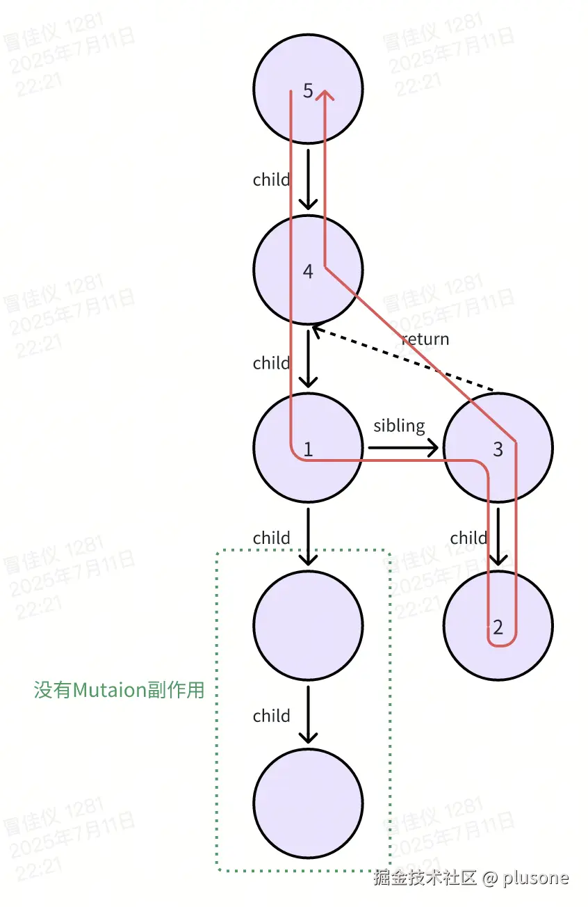
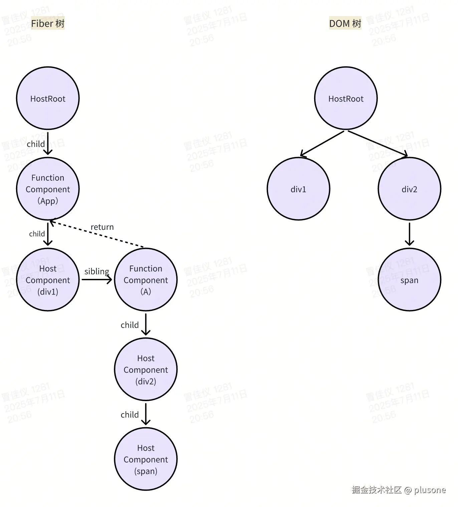
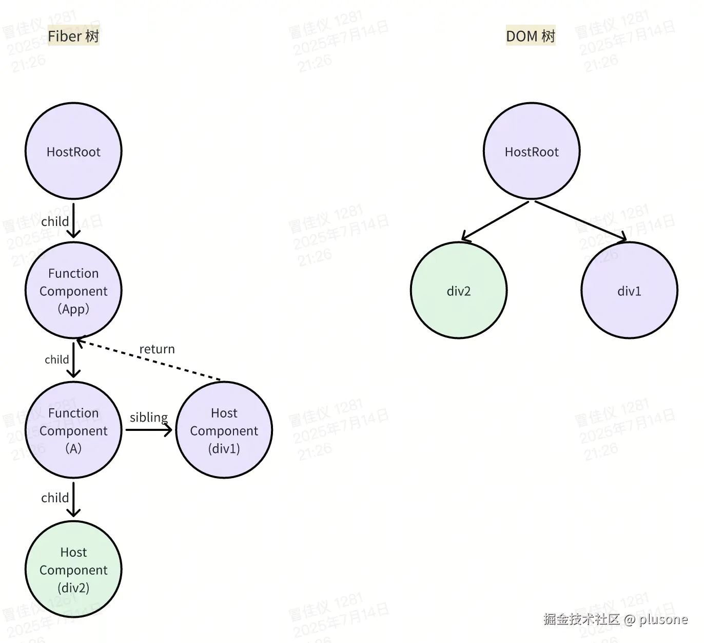
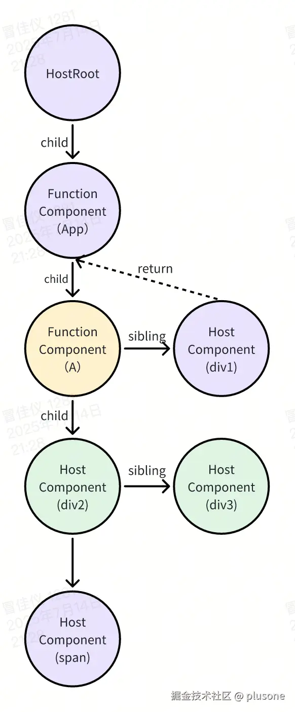

[【React18 源码解析】（三）调度](url) 中讲过 React 的更新经过同步或异步**调度**最终都会执行 `performWorkOnRoot`。

```ts
function performConcurrentWorkOnRoot(root, didTimeout) {
  const originalCallbackNode = root.callbackNode;

  const lanes = getNextLanes(root, root === workInProgressRoot ? workInProgressRootRenderLanes : NoLanes);
  if (lanes === NoLanes) {
    return null;
  }

  const shouldTimeSlice = !includesExpiredLane(root, lanes) &&
  const exitStatus = shouldTimeSlice
    ? renderRootConcurrent(root, lanes)
    : renderRootSync(root, lanes);

  if (exitStatus !== RootInProgress) {
    const finishedWork = root.current.alternate;
    root.finishedWork = finishedWork;
    root.finishedLanes = lanes;
    finishConcurrentRender(root, exitStatus, lanes);
  }

  if (root.callbackNode === originalCallbackNode) {
    return performConcurrentWorkOnRoot.bind(null, root);
  }

  return null;
}
```

其中：

**1. 执行 `renderRoot`，过程可中断，返回渲染状态**

- `renderRoot` 结束时，当前正在构建的 `workInProgress` 为 `null` 表示 Fiber 树构建未结束，为中断场景，返回 `RootInProgress` 状态。

- `renderRoot` 结束时，当前正在构建的 `workInProgress` 不为 `null` 表示 Fiber 树构建结束，返回全局变量 `workInProgressRootExitStatus`，`workInProgressRootExitStatus` 在 `completeUnitOfWork` 向上回溯的循环回到 `FiberRoot` 结束时赋值为 `RootCompleted`。

> 具体见[【React18 源码解析】（四）render 阶段](url)

**2. 给 `root.finishedWork` 赋值**

给 `finishedWork` 赋值为 `root.current.alternate`，即 `RootFiber` 节点的 `workInProgress` 节点，表示当前需要提交的 Fiber 树。

**3. 通过 `renderRoot` 返回的渲染状态判断是否进入 commit 阶段**

- 状态不是 `RootInProgress` 才进入 `finishConcurrentRender`。

- `finishConcurrentRender` 中判断状态，调用 `commitRoot`。

```ts
function finishConcurrentRender(root, exitStatus, lanes) {
  switch (exitStatus) {
    case RootInProgress: {
      throw new Error('Root did not complete. This is a bug in React.');
    }
    ...
    case RootCompleted: {
      commitRoot(root, workInProgressRootRecoverableErrors);
      break;
    }
    default: {
      throw new Error('Unknown root exit status.');
    }
  }
}
```

**4. 执行 `commitRoot`，进入 commit 阶段**

本文重点分析 React 中的 commit 阶段。**commit 阶段主要是将 render 阶段构建完成的 Fiber 树上记录的变更应用到真实 DOM 中**。

# commitRoot

来看下精简后的 `commitRoot` 源码：

```ts
function commitRootImpl(
  root: FiberRoot,
  recoverableErrors: null | Array<mixed>,
  renderPriorityLevel: EventPriority
) {
  do {
    flushPassiveEffects();
  } while (rootWithPendingPassiveEffects !== null);

  if ((executionContext & (RenderContext | CommitContext)) !== NoContext) {
    throw new Error("Should not already be working.");
  }

  const finishedWork = root.finishedWork;
  const lanes = root.finishedLanes;

  if (finishedWork === null) {
    return null;
  }

  root.finishedWork = null;
  root.finishedLanes = NoLanes;
  root.callbackNode = null;
  root.callbackPriority = NoLane;

  let remainingLanes = mergeLanes(finishedWork.lanes, finishedWork.childLanes);
  markRootFinished(root, remainingLanes);

  if (
    (finishedWork.subtreeFlags & PassiveMask) !== NoFlags ||
    (finishedWork.flags & PassiveMask) !== NoFlags
  ) {
    if (!rootDoesHavePassiveEffects) {
      rootDoesHavePassiveEffects = true;
      pendingPassiveEffectsRemainingLanes = remainingLanes;
      scheduleCallback(NormalSchedulerPriority, () => {
        flushPassiveEffects();
        return null;
      });
    }
  }

  const subtreeHasEffects =
    (finishedWork.subtreeFlags &
      (BeforeMutationMask | MutationMask | LayoutMask | PassiveMask)) !==
    NoFlags;
  const rootHasEffect =
    (finishedWork.flags &
      (BeforeMutationMask | MutationMask | LayoutMask | PassiveMask)) !==
    NoFlags;

  if (subtreeHasEffects || rootHasEffect) {
    const prevTransition = ReactCurrentBatchConfig.transition;
    ReactCurrentBatchConfig.transition = null;
    const previousPriority = getCurrentUpdatePriority();
    setCurrentUpdatePriority(DiscreteEventPriority);

    const prevExecutionContext = executionContext;
    executionContext |= CommitContext;

    ReactCurrentOwner.current = null;

    const shouldFireAfterActiveInstanceBlur = commitBeforeMutationEffects(
      root,
      finishedWork
    );

    commitMutationEffects(root, finishedWork, lanes);

    root.current = finishedWork;

    commitLayoutEffects(finishedWork, root, lanes);

    executionContext = prevExecutionContext;

    setCurrentUpdatePriority(previousPriority);
    ReactCurrentBatchConfig.transition = prevTransition;
  } else {
    root.current = finishedWork;
  }

  ensureRootIsScheduled(root, now());

  remainingLanes = root.pendingLanes;

  flushSyncCallbacks();

  return null;
}
```

其中做的事情如下：

## 1. 同步清理遗留的 Passive Effects

```ts
do {
  flushPassiveEffects();
} while (rootWithPendingPassiveEffects !== null);
```

### Passive Effects 是什么

Passive Effects 指的是 `useEffect` 中注册的副作用函数，它们会在 DOM 更新后**异步**执行，不阻塞浏览器绘制。

与之相对的是 `useLayoutEffect`，是在 commit 阶段同步执行的。

### flushPassiveEffects

`flushPassiveEffects()` 是用来执行 Fiber 树上待执行的 Passive Effects 的函数。

```ts
function flushPassiveEffects() {
  if (rootWithPendingPassiveEffects === null) {
    return false;
  }

  const root = rootWithPendingPassiveEffects;
  const lanes = pendingPassiveEffectsLanes;
  rootWithPendingPassiveEffects = null;
  pendingPassiveEffectsLanes = NoLanes;

  const prevExecutionContext = executionContext;
  executionContext |= CommitContext;

  commitPassiveUnmountEffects(root.current);
  commitPassiveMountEffects(root, root.current);

  executionContext = prevExecutionContext;

  flushSyncCallbacks();

  return true;
}
```

先设置当前 root 和 lanes，然后依次执行以下三个核心步骤：

#### 1. commitPassiveUnmountEffects 卸载阶段

遍历整棵 Fiber 树，执行所有待销毁节点的 `useEffect` destroy 函数。

```ts
export function commitPassiveUnmountEffects(firstChild: Fiber): void {
  nextEffect = firstChild;
  while (nextEffect !== null) {
    const fiber = nextEffect;
    const child = fiber.child;

    if ((nextEffect.flags & ChildDeletion) !== NoFlags) {
      const deletions = fiber.deletions;
      if (deletions !== null) {
        for (let i = 0; i < deletions.length; i++) {
          const fiberToDelete = deletions[i];
          nextEffect = fiberToDelete;
          commitPassiveUnmountEffectsInsideOfDeletedTree_begin(
            fiberToDelete,
            fiber
          );
        }

        nextEffect = fiber;
      }
    }

    if ((fiber.subtreeFlags & PassiveMask) !== NoFlags && child !== null) {
      ensureCorrectReturnPointer(child, fiber);
      nextEffect = child;
    } else {
      while (nextEffect !== null) {
        const fiber = nextEffect;
        if ((fiber.flags & Passive) !== NoFlags) {
          commitPassiveUnmountOnFiber(fiber);
        }

        const sibling = fiber.sibling;
        if (sibling !== null) {
          ensureCorrectReturnPointer(sibling, fiber.return);
          nextEffect = sibling;
          return;
        }

        nextEffect = fiber.return;
      }
    }
  }
}
```

从 `RootFiber` 节点开始**深度优先**遍历，遍历逻辑为：

1. 如果当前遍历到的节点标记了 `ChildDeletion` 副作用，即有子节点需要被删除，就遍历 `fiber.deletions` 数组，对每个要删除的子节点执行 `commitPassiveUnmountEffectsInsideOfDeletedTree_begin` 深度卸载子树。

2. 如果当前遍历到的节点有 `child` 子节点且子树上还有 Passive Effect，就向子节点遍历，继续找需要卸载的子树。

3. 如果当前遍历到的节点没有 `child` 子节点或子树上没有 Passive Effect，则这个节点的子树中没有需要卸载的了，不再向子节点遍历。并且：

   - 判断当前节点是否标记了 `Passive`，标记了则执行 `commitPassiveUnmountOnFiber` 卸载它本身。

   - 尝试向 `sibling` 兄弟节点遍历。

   - 没有 `sibling` 兄弟节点，就回溯遍历父节点。一路向上回溯，直到回到 `RootFiber` 节点，遍历结束。

> Fiber 树遍历顺序如下图红色箭头所示。
>
> `commitPassiveUnmountOnFiber` 处理顺序如数字顺序所示，即**先处理子节点，再处理父节点**。



---

> 下面展开看 `commitPassiveUnmountEffects` 中用到的两个执行 `useEffect` 卸载逻辑的工具函数。

##### commitPassiveUnmountEffectsInsideOfDeletedTree_begin

用于对 Fiber 树中每一个节点执行卸载逻辑。

```ts
function commitPassiveUnmountEffectsInsideOfDeletedTree_begin(
  deletedSubtreeRoot: Fiber,
  nearestMountedAncestor: Fiber | null
) {
  while (nextEffect !== null) {
    const fiber = nextEffect;

    commitPassiveUnmountInsideDeletedTreeOnFiber(fiber, nearestMountedAncestor);

    const child = fiber.child;

    if (child !== null) {
      ensureCorrectReturnPointer(child, fiber);
      nextEffect = child;
    } else {
      while (nextEffect !== null) {
        const fiber = nextEffect;
        const sibling = fiber.sibling;
        const returnFiber = fiber.return;

        if (sibling !== null) {
          ensureCorrectReturnPointer(sibling, returnFiber);
          nextEffect = sibling;
          return;
        }

        nextEffect = returnFiber;
      }
    }
  }
}
```

1. 深度优先遍历 `fiberToDelete` 的整棵子树（和 `commitPassiveUnmountEffects` 遍历的顺序一致），对其中每个节点执行 `commitPassiveUnmountInsideDeletedTreeOnFiber`。

```ts
function commitPassiveUnmountInsideDeletedTreeOnFiber(
  current: Fiber,
  nearestMountedAncestor: Fiber | null,
): void {
  switch (current.tag) {
    case FunctionComponent:
    case ForwardRef:
    case SimpleMemoComponent: {
      commitHookEffectListUnmount(
        HookPassive,
        current,
        nearestMountedAncestor,
      );
      break;
    }
    ...
  }
}
```

2. `commitPassiveUnmountInsideDeletedTreeOnFiber` 中对函数组件执行 `commitHookEffectListUnmount`，因为只有函数组件有 `useEffect`。

```ts
function commitHookEffectListUnmount(
  flags: HookFlags,
  finishedWork: Fiber,
  nearestMountedAncestor: Fiber | null,
) {
  const updateQueue: FunctionComponentUpdateQueue | null = (finishedWork.updateQueue: any);
  const lastEffect = updateQueue !== null ? updateQueue.lastEffect : null;
  if (lastEffect !== null) {
    const firstEffect = lastEffect.next;
    let effect = firstEffect;
    do {
      if ((effect.tag & flags) === flags) {
        const destroy = effect.destroy;
        effect.destroy = undefined;
        if (destroy !== undefined) {
          safelyCallDestroy(finishedWork, nearestMountedAncestor, destroy);
        }
      }
      effect = effect.next;
    } while (effect !== firstEffect);
  }
}
```

3. `commitHookEffectListUnmount` 中从节点的 `updateQueue.lastEffect` 上获取 effect 链，并对每个 effect 执行 `effect.destroy()`，即 `useEffect(...).return()`。

##### commitPassiveUnmountOnFiber

用于对某一个 Fiber 节点执行卸载逻辑。同样是调用 `commitHookEffectListUnmount`。

```ts
function commitPassiveUnmountOnFiber(finishedWork: Fiber) {
  switch (finishedWork.tag) {
    case FunctionComponent:
    case ForwardRef:
    case SimpleMemoComponent: {
      commitHookEffectListUnmount(
        HookPassive | HookHasEffect,
        finishedWork,
        finishedWork.return
      );
      break;
    }
  }
}
```

#### 2. commitPassiveMountEffects 挂载阶段

深度优先遍历 Fiber 树（和 `commitPassiveUnmountEffects` 遍历的顺序一致），如果遍历到的节点标记了 `Passive` 副作用，就执行 `commitPassiveMountOnFiber`，即调用 `useEffect` 的 create 函数。

```ts
function commitPassiveMountEffects(subtreeRoot: Fiber, root: FiberRoot) {
  while (nextEffect !== null) {
    const fiber = nextEffect;
    const firstChild = fiber.child;
    if ((fiber.subtreeFlags & PassiveMask) !== NoFlags && firstChild !== null) {
      ensureCorrectReturnPointer(firstChild, fiber);
      nextEffect = firstChild;
    } else {
      while (nextEffect !== null) {
        const fiber = nextEffect;
        if ((fiber.flags & Passive) !== NoFlags) {
          try {
            commitPassiveMountOnFiber(root, fiber);
          } catch (error) {
            captureCommitPhaseError(fiber, fiber.return, error);
          }
        }

        if (fiber === subtreeRoot) {
          nextEffect = null;
          return;
        }

        const sibling = fiber.sibling;
        if (sibling !== null) {
          ensureCorrectReturnPointer(sibling, fiber.return);
          nextEffect = sibling;
          return;
        }

        nextEffect = fiber.return;
      }
    }
  }
}
```

##### commitPassiveMountOnFiber

对于函数类型组件调用 `commitHookEffectListUnmount` 从节点的 `updateQueue.lastEffect` 上获取 effect 链，并对每个 effect 执行 `effect.create()`，即 `useEffect(...)` 回调函数。

```ts
function commitPassiveMountOnFiber(
  finishedRoot: FiberRoot,
  finishedWork: Fiber,
): void {
  switch (finishedWork.tag) {
    case FunctionComponent:
    case ForwardRef:
    case SimpleMemoComponent: {
      commitHookEffectListMount(HookPassive | HookHasEffect, finishedWork);
      break;
    }
    ...
  }
}
```

```ts
function commitHookEffectListMount(flags: HookFlags, finishedWork: Fiber) {
  const updateQueue: FunctionComponentUpdateQueue | null = (finishedWork.updateQueue: any);
  const lastEffect = updateQueue !== null ? updateQueue.lastEffect : null;
  if (lastEffect !== null) {
    const firstEffect = lastEffect.next;
    let effect = firstEffect;
    do {
      if ((effect.tag & flags) === flags) {
        const create = effect.create;
        effect.destroy = create();
      }
      effect = effect.next;
    } while (effect !== firstEffect);
  }
}
```

#### 3. flushSyncCallbacks

用于在执行所有 `useEffect` 的 `destroy()` 和 `create()` 之后，立即执行所有注册的同步副作用回调。

比如在 `useEffect` 回调里调用的 `setState` 更新立即生效，否则 `setState` 可能会延迟到下一帧，造成 UI 卡顿或不一致。

实现就是循环从同步队列 `syncQueue` 里面取任务然后执行：

```ts
export function flushSyncCallbacks() {
  if (!isFlushingSyncQueue && syncQueue !== null) {
    isFlushingSyncQueue = true;
    let i = 0;
    const previousUpdatePriority = getCurrentUpdatePriority();
    try {
      const isSync = true;
      const queue = syncQueue;
      setCurrentUpdatePriority(DiscreteEventPriority);
      for (; i < queue.length; i++) {
        let callback = queue[i];
        do {
          callback = callback(isSync);
        } while (callback !== null);
      }
      syncQueue = null;
      includesLegacySyncCallbacks = false;
    } catch (error) {
      if (syncQueue !== null) {
        syncQueue = syncQueue.slice(i + 1);
      }
      scheduleCallback(ImmediatePriority, flushSyncCallbacks);
      throw error;
    } finally {
      setCurrentUpdatePriority(previousUpdatePriority);
      isFlushingSyncQueue = false;
    }
  }
  return null;
}
```

### 同步调用 flushPassiveEffects

此处是同步调用 `flushPassiveEffects` 的场景，即：刚进入 `commitRoot` 时，如果上轮更新后异步注册的 `useEffect` 还没执行完，需要先将遗留的执行完，避免污染新的提交。

异步调用 `flushPassiveEffects` 的场景，即 Passive Effects （`useEffect`）的异步执行，在后面会说到。

## 2. 检查是否可提交

```ts
if ((executionContext & (RenderContext | CommitContext)) !== NoContext) {
  throw new Error("Should not already be working.");
}

const finishedWork = root.finishedWork;
if (finishedWork === null) {
  return null;
}
```

两个检查：

**1. 通过 `executionContext` 确保当前不是嵌套的 render 或 commit**

`executionContext` 是一个用于记录 React 当前正处于哪个阶段的全局变量（具体见[这里](url)）。当前如果正处于 render 或 commit 阶段，直接报错。

**2. 判断当前有需要提交的 Fiber 树**

`root.finishedWork` 在 render 阶段结束，进入 commit 阶段之前赋值，没有则直接 `return`。

## 3. 重置 root 状态

```ts
root.finishedWork = null;
root.finishedLanes = NoLanes;
root.callbackNode = null;
root.callbackPriority = NoLane;
```

## 4. 计算剩余更新

获取节点上剩余的更新（可能是被跳过的低优先级更新），放到 `root.pendingLanes` 上，下一次调度再处理。

```ts
let remainingLanes = mergeLanes(finishedWork.lanes, finishedWork.childLanes);
markRootFinished(root, remainingLanes);
```

## 5. 异步调度本轮 Passive Effects

对本轮产生的 `Passive` 副作用，通过 Scheduler 包中的 `scheduleCallback` 进行[异步调度](url)，将 `flushPassiveEffects` 添加到宏任务异步执行。即，在 commit 阶段结束之后才会异步执行 `useEffect`。

```ts
if (
  (finishedWork.subtreeFlags & PassiveMask) !== NoFlags ||
  (finishedWork.flags & PassiveMask) !== NoFlags
) {
  if (!rootDoesHavePassiveEffects) {
    rootDoesHavePassiveEffects = true;
    pendingPassiveEffectsRemainingLanes = remainingLanes;
    scheduleCallback(NormalSchedulerPriority, () => {
      flushPassiveEffects();
      return null;
    });
  }
}
```

## 6. 判断是否有副作用需要执行

判断 `finishedWork` 和它的子树上是否有 `BeforeMutationMask`、`MutationMask`、`LayoutMask` 副作用标识，有的话进入下面三个阶段的 commit。

```ts
const subtreeHasEffects =
  (finishedWork.subtreeFlags &
    (BeforeMutationMask | MutationMask | LayoutMask | PassiveMask)) !==
  NoFlags;
const rootHasEffect =
  (finishedWork.flags &
    (BeforeMutationMask | MutationMask | LayoutMask | PassiveMask)) !==
  NoFlags;
```

---

> 三个阶段的 commit 为三次深度优先遍历的循环。

## 7. commitBeforeMutationEffects

Before Mutation 阶段，调用 `getSnapshotBeforeUpdate` 等生命周期钩子。

```ts
function commitBeforeMutationEffects_begin() {
  while (nextEffect !== null) {
    const fiber = nextEffect;

    if (enableCreateEventHandleAPI) {
      const deletions = fiber.deletions;
      if (deletions !== null) {
        for (let i = 0; i < deletions.length; i++) {
          const deletion = deletions[i];
          commitBeforeMutationEffectsDeletion(deletion);
        }
      }
    }

    const child = fiber.child;
    if (
      (fiber.subtreeFlags & BeforeMutationMask) !== NoFlags &&
      child !== null
    ) {
      ensureCorrectReturnPointer(child, fiber);
      nextEffect = child;
    } else {
      while (nextEffect !== null) {
        const fiber = nextEffect;
        try {
          commitBeforeMutationEffectsOnFiber(fiber);
        } catch (error) {
          captureCommitPhaseError(fiber, fiber.return, error);
        }

        const sibling = fiber.sibling;
        if (sibling !== null) {
          ensureCorrectReturnPointer(sibling, fiber.return);
          nextEffect = sibling;
          return;
        }

        nextEffect = fiber.return;
      }
    }
  }
}
```

从 `finishedWork` 也就是 `RootFiber` 节点开始深度优先遍历整棵 Fiber 树。

**1. 对于每个遍历到的节点，处理其即将被删除的子节点**

遍历将被删除的子节点（`fiber.deletions`），调用 `commitBeforeMutationEffectsDeletion`，派发 onBlur 事件，提前清除将被删除元素的焦点。

> React 中删除一个元素，比如 `<input />`，浏览器通常会自己触发 blur。但 React 需要在 DOM 删除之前处理副作用，比如派发 onBlur 事件，否则可能出现组件已经消失，但 onBlur 事件还没处理，导致状态错乱。

```ts
function commitBeforeMutationEffectsDeletion(deletion: Fiber) {
  if (enableCreateEventHandleAPI) {
    if (doesFiberContain(deletion, ((focusedInstanceHandle: any): Fiber))) {
      shouldFireAfterActiveInstanceBlur = true;
      beforeActiveInstanceBlur(deletion);
    }
  }
}
```

**2. 对于没有子节点或子树没 `BeforeMutationMask` 副作用的节点，处理 `getSnapshotBeforeUpdate` 逻辑**

调用 `commitBeforeMutationEffectsOnFiber`，其中针对类组件，判断是否有 `Snapshot` 标记（在 `completeUnitOfWork` -> `completeWork` 中打标），有的话就获取类组件实例上的 `getSnapshotBeforeUpdate` 方法并执行，得到 snapshot，挂在 `instance.__reactInternalSnapshotBeforeUpdate`。

```ts
function commitBeforeMutationEffectsOnFiber(finishedWork: Fiber) {
  const current = finishedWork.alternate;
  const flags = finishedWork.flags;

  if ((flags & Snapshot) !== NoFlags) {
    switch (finishedWork.tag) {
      case ClassComponent: {
        if (current !== null) {
          const prevProps = current.memoizedProps;
          const prevState = current.memoizedState;
          const instance = finishedWork.stateNode;
          const snapshot = instance.getSnapshotBeforeUpdate(
            finishedWork.elementType === finishedWork.type
              ? prevProps
              : resolveDefaultProps(finishedWork.type, prevProps),
            prevState
          );
          instance.__reactInternalSnapshotBeforeUpdate = snapshot;
        }
        break;
      }
    }
  }
}
```

执行 `getSnapshotBeforeUpdate` 时 DOM 还未真正变更，得到的 snapshot 会在后续 DOM 变更后执行的 `componentDidUpdate` 中使用，一般用于读取旧的 DOM 状态。

```ts
class MyComponent extends React.Component {
  listRef = React.createRef();

  getSnapshotBeforeUpdate(prevProps, prevState) {
    // 获取滚动位置，在 DOM 更新前
    return this.listRef.current.scrollTop;
  }

  componentDidUpdate(prevProps, prevState, snapshot) {
    // snapshot 会自动传入上一步返回的值
    console.log("之前的 scrollTop 是:", snapshot);
  }

  render() {
    return <div ref={this.listRef}>...</div>;
  }
}
```

## 8. commitMutationEffects

Mutation 阶段，实际操作 DOM，如：添加、更新、删除、处理 ref 等。

```ts
function commitMutationEffects_begin(root: FiberRoot, lanes: Lanes) {
  while (nextEffect !== null) {
    const fiber = nextEffect;

    const deletions = fiber.deletions;
    if (deletions !== null) {
      for (let i = 0; i < deletions.length; i++) {
        const childToDelete = deletions[i];
        try {
          commitDeletion(root, childToDelete, fiber);
        } catch (error) {
          captureCommitPhaseError(childToDelete, fiber, error);
        }
      }
    }

    const child = fiber.child;
    if ((fiber.subtreeFlags & MutationMask) !== NoFlags && child !== null) {
      ensureCorrectReturnPointer(child, fiber);
      nextEffect = child;
    } else {
      while (nextEffect !== null) {
        const fiber = nextEffect;
        try {
          commitMutationEffectsOnFiber(fiber, root, lanes);
        } catch (error) {
          captureCommitPhaseError(fiber, fiber.return, error);
        }

        const sibling = fiber.sibling;
        if (sibling !== null) {
          ensureCorrectReturnPointer(sibling, fiber.return);
          nextEffect = sibling;
          return;
        }

        nextEffect = fiber.return;
      }
    }
  }
}
```

从 `finishedWork` 也就是 `RootFiber` 节点开始深度优先遍历整棵 Fiber 树。

**1. 对于每个遍历到的节点，处理其即将被删除的子节点**

当前节点有需要被删除的子节点（`fiber.deletions`），就对每个要删除的子节点调用 `commitDeletion`，递归删除和卸载节点对应的整个子树。

**2. 对于没有子节点或子树没 `MutationMask` 副作用的节点，处理 `Mutation` 副作用**

- 调用 `commitMutationEffectsOnFiber`，根据 Fiber 上的 `flags`，将不同变更同步到 DOM 中，包括：插入 DOM、更新 DOM、清空文本、处理 ref。

- 停止向子节点遍历，开始遍历兄弟节点，没有兄弟节点，就遍历父节点。

**3. 对于有子节点且子树有副作用的节点，则继续向子节点遍历**

---

> 遍历顺序如下图红色箭头所示，为经典的深度优先遍历。
>
> `Mutation` 副作用处理顺序如数字顺序所示，即**先处理子节点，再处理父节点**。
>
> 前面第一个阶段的 `commitBeforeMutationEffects` 循环也是这个执行顺序。


---

> 下面来看 `commitDeletion` 和 `commitMutationEffectsOnFiber` 的具体实现。

### commitDeletion

用于递归删除和卸载指定 Fiber 对应的整个子树。包括删除 DOM、调用 `useEffect` 的 destroy、调用 `componentWillUnmount`、ref 解绑、清除 Fiber 节点指针等。

分为两个核心步骤：`unmountHostComponents` 和 `detachFiberMutation`。

```ts
function commitDeletion(
  finishedRoot: FiberRoot,
  current: Fiber,
  nearestMountedAncestor: Fiber
): void {
  unmountHostComponents(finishedRoot, current, nearestMountedAncestor);

  detachFiberMutation(current);
}
```

#### unmountHostComponents

从要删除的 Fiber 节点开始，深度优先遍历整个要删除的 Fiber 子树，删除**第一层 DOM 节点**，并对每个遍历到的 Fiber 节点执行卸载逻辑（调用 `useEffect` 的 destroy、调用 `componentWillUnmount`、ref 解绑等）。

> 这个**第一层 DOM 节点**怎么理解呢？
>
> 首先我们需要知道，Fiber 树的结构和 DOM 树的结构并不完全对应，比如下面这段代码，对应的 Fiber 树和 DOM 树如图：

```ts
function App() {
  return (
    <>
      <div />
      <A />
    </>
  );
}

function A() {
  return (
    <div>
      <span>hello world</span>
    </div>
  );
}
```



> 要删除 `<App />` 这个 Fiber 节点，在 DOM 树中，只需要以 `HostRoot` 节点对应的 DOM 元素为 `parent`，然后 `parent.removeChild(div1)` 和 `parent.removeChild(div2)` 即可。`div2` 删了，它的子 DOM 节点 `span` 自然也就删了。
>
> 所以，对于一整棵要删除的 Fiber 树，我们只要关注它的**最近 DOM 父节点**和**第一层 DOM 节点**即可。

下面来看源码实现：

```ts
function unmountHostComponents(
  finishedRoot: FiberRoot,
  current: Fiber,
  nearestMountedAncestor: Fiber,
): void {
  let node: Fiber = current;

  let currentParentIsValid = false;

  let currentParent;
  let currentParentIsContainer;

  while (true) {
    if (!currentParentIsValid) {
      let parent = node.return;
      findParent: while (true) {
        if (parent === null) {
          throw new Error(
            'Expected to find a host parent. This error is likely caused by ' +
              'a bug in React. Please file an issue.',
          );
        }

        const parentStateNode = parent.stateNode;
        switch (parent.tag) {
          case HostComponent:
            currentParent = parentStateNode;
            currentParentIsContainer = false;
            break findParent;
          case HostRoot:
            currentParent = parentStateNode.containerInfo;
            currentParentIsContainer = true;
            break findParent;
          case HostPortal:
            currentParent = parentStateNode.containerInfo;
            currentParentIsContainer = true;
            break findParent;
        }
        parent = parent.return;
      }
      currentParentIsValid = true;
    }

    if (node.tag === HostComponent || node.tag === HostText) {
      commitNestedUnmounts(finishedRoot, node, nearestMountedAncestor);
      if (currentParentIsContainer) {
        removeChildFromContainer(
          ((currentParent: any): Container),
          (node.stateNode: Instance | TextInstance),
        );
      } else {
        removeChild(
          ((currentParent: any): Instance),
          (node.stateNode: Instance | TextInstance),
        );
      }
    } else if (node.tag === HostPortal) {
      ...
    } else {
      commitUnmount(finishedRoot, node, nearestMountedAncestor);
      if (node.child !== null) {
        node.child.return = node;
        node = node.child;
        continue;
      }
    }
    if (node === current) {
      return;
    }
    while (node.sibling === null) {
      if (node.return === null || node.return === current) {
        return;
      }
      node = node.return;
      if (node.tag === HostPortal) {
        currentParentIsValid = false;
      }
    }
    node.sibling.return = node.return;
    node = node.sibling;
  }
}
```

深度优先遍历：

**1. 寻找最近 DOM 父节点**

包括 `HostComponent`、`HostRoot`、`HostPortal` 类型的 Fiber 节点。

**前面分析过，只需要 `parent.removeChild` 删除第一层 DOM 节点，所以只要找「一次」最近 DOM 父节点即可**，这里使用 `currentParentIsValid` 字段做缓存，可以避免重复寻找。

**2. 删除第一层 DOM 节点**

遍历到的节点，如果是 `HostComponent`、`HostRoot`、`HostPortal` 类型（即 DOM 节点）：

- 调用 `parent.removeChild` 删除该 DOM 节点。

- 调用 `commitNestedUnmounts` 卸载当前节点以及其子树。

- 继续遍历兄弟 Fiber 节点，没有兄弟节点就找父节点的兄弟节点。

如果不是 DOM 节点，且存在子 Fiber 节点：

- 调用 `commitUnmount` 卸载当前节点。

- 继续遍历子 Fiber 节点。

##### commitNestedUnmounts

深度优先遍历 Fiber 树，对每个节点调用 `commitUnmount`。

```ts
function commitNestedUnmounts(
  root: FiberRoot,
  rootChildToDelete: Fiber,
  nearestMountedAncestor: Fiber
): void {
  let node: Fiber = rootChildToDelete;

  while (true) {
    commitUnmount(root, node, nearestMountedAncestor); // 👈 卸载该节点上的副作用

    const child = node.child;
    if (child !== null) {
      child.return = node;
      node = child;
      continue;
    }

    if (node === rootChildToDelete) {
      return;
    }

    while (node.sibling === null) {
      if (node.return === null || node.return === rootChildToDelete) {
        return;
      }
      node = node.return;
    }

    node.sibling.return = node.return;
    node = node.sibling;
  }
}
```

##### commitUnmount

单个节点的卸载逻辑：

- 对函数组件，调用 `useEffect` 的 destroy 函数。

- 对类组件，调用类实例上的 `componentWillUnmount`。

- 对原生 DOM 节点，清理 ref。

```ts
function commitUnmount(
  finishedRoot: FiberRoot,
  current: Fiber,
  nearestMountedAncestor: Fiber,
): void {
  switch (current.tag) {
    case FunctionComponent:
    case ForwardRef:
    case MemoComponent:
    case SimpleMemoComponent: {
      const updateQueue: FunctionComponentUpdateQueue | null = (current.updateQueue: any);
      if (updateQueue !== null) {
        const lastEffect = updateQueue.lastEffect;
        if (lastEffect !== null) {
          const firstEffect = lastEffect.next;

          let effect = firstEffect;
          do {
            const {destroy, tag} = effect;
            if (destroy !== undefined) {
              safelyCallDestroy(current, nearestMountedAncestor, destroy);
            }
            effect = effect.next;
          } while (effect !== firstEffect);
        }
      }
      return;
    }
    case ClassComponent: {
      safelyDetachRef(current, nearestMountedAncestor);
      const instance = current.stateNode;
      if (typeof instance.componentWillUnmount === 'function') {
        safelyCallComponentWillUnmount(
          current,
          nearestMountedAncestor,
          instance,
        );
      }
      return;
    }
    case HostComponent: {
      safelyDetachRef(current, nearestMountedAncestor);
      return;
    }
  }
}
```

#### detachFiberMutation

清除要删除的 Fiber 节点的指针，将该节点从 Fiber 树中断开，包括 `current` 和 `workInProgress` 两棵树。

主要用于释放引用，避免内存泄露。

```ts
function detachFiberMutation(fiber: Fiber) {
  const alternate = fiber.alternate;
  if (alternate !== null) {
    alternate.return = null;
  }
  fiber.return = null;
}
```

### commitMutationEffectsOnFiber

用于对单个节点，根据 Fiber 上的 `flags`，将不同变更同步到 DOM 中，包括：插入 DOM、更新 DOM、清空文本、处理 ref。

```ts
function commitMutationEffectsOnFiber(
  finishedWork: Fiber,
  root: FiberRoot,
  lanes: Lanes
) {
  const flags = finishedWork.flags;

  if (flags & ContentReset) {
    commitResetTextContent(finishedWork);
  }

  if (flags & Ref) {
    const current = finishedWork.alternate;
    if (current !== null) {
      commitDetachRef(current);
    }
  }

  const primaryFlags = flags & (Placement | Update);
  outer: switch (primaryFlags) {
    case Placement: {
      commitPlacement(finishedWork);
      finishedWork.flags &= ~Placement;
      break;
    }
    case PlacementAndUpdate: {
      commitPlacement(finishedWork);
      const current = finishedWork.alternate;
      commitWork(current, finishedWork);
      break;
    }
    case Update: {
      const current = finishedWork.alternate;
      commitWork(current, finishedWork);
      break;
    }
  }
}
```

不同 `flags` 的处理如下：

#### ContentReset

调用 `commitResetTextContent` **重置文本内容**。

针对 `<div>text</div>` -> `<div>{children}</div>` 这种原来是纯文本，现在不是的场景，在 [render 阶段 `completeUnitOfWork` -> `completeWork` -> `updateHostComponent`](url) 中打标。

此处从 `current.stateNode` 上获取 DOM 实例，然后直接 `node.textContent = ""` 清空旧的文本内容。

```ts
function commitResetTextContent(current: Fiber) {
  setTextContent(current.stateNode, "");
}
```

```ts
const setTextContent = function (node: Element, text: string): void {
  if (text) {
    const firstChild = node.firstChild;

    if (
      firstChild &&
      firstChild === node.lastChild &&
      firstChild.nodeType === TEXT_NODE
    ) {
      firstChild.nodeValue = text;
      return;
    }
  }
  node.textContent = text;
};
```

#### Ref

如果组件上存在 ref，调用 `commitDetachRef` **卸载旧 ref**。

React 会在 Mutation 阶段的 commit 中清除旧的 ref，然后在后续的 Layout 阶段的 commit 中重新绑定。

此处判断旧 ref 的类型，如果是 `function`，则执行 `currentRef(null)`，否则直接 `currentRef.current = null`，将之前绑定的 DOM 实例或类组件实例清楚。

```ts
function commitDetachRef(current: Fiber) {
  const currentRef = current.ref;
  if (currentRef !== null) {
    if (typeof currentRef === "function") {
      if (
        enableProfilerTimer &&
        enableProfilerCommitHooks &&
        current.mode & ProfileMode
      ) {
        try {
          startLayoutEffectTimer();
          currentRef(null);
        } finally {
          recordLayoutEffectDuration(current);
        }
      } else {
        currentRef(null);
      }
    } else {
      currentRef.current = null;
    }
  }
}
```

#### Placement

调用 `commitPlacement` **插入 DOM**。

`Placement` 标记在 `beginWork` 的 [reconcile 阶段](url)中打标。

##### commitPlacement

`commitPlacement` 会将当前 Fiber 对应的 DOM 节点，插入到正确的 DOM 父节点下，兄弟节点之前。

下面来看精简后的 `commitPlacement` 源码：

```ts
function commitPlacement(finishedWork: Fiber): void {
  const parentFiber = getHostParentFiber(finishedWork);

  switch (parentFiber.tag) {
    case HostComponent: {
      const parent: Instance = parentFiber.stateNode;
      if (parentFiber.flags & ContentReset) {
        resetTextContent(parent);
        parentFiber.flags &= ~ContentReset;
      }
      const before = getHostSibling(finishedWork);
      insertOrAppendPlacementNode(finishedWork, before, parent);
      break;
    }
    case HostRoot:
    case HostPortal: {
      const parent: Container = parentFiber.stateNode.containerInfo;
      const before = getHostSibling(finishedWork);
      insertOrAppendPlacementNodeIntoContainer(finishedWork, before, parent);
      break;
    }
    default:
      throw new Error(...);
  }
}
```

**1. 寻找最近 DOM 父节点**

调用 `getHostParentFiber` 从当前 Fiber 开始向上遍历父节点，直到找到最近的 `HostComponent` / `HostRoot` / `HostPortal` 节点，即最近的 DOM 父节点。

然后取 `parentFiber.stateNode` 即用于插入的 DOM 父容器。

```ts
function getHostParentFiber(fiber: Fiber): Fiber {
  let parent = fiber.return;
  while (parent !== null) {
    if (isHostParent(parent)) {
      return parent;
    }
    parent = parent.return;
  }

  throw new Error(...);
}

function isHostParent(fiber: Fiber): boolean {
  return (
    fiber.tag === HostComponent ||
    fiber.tag === HostRoot ||
    fiber.tag === HostPortal
  );
}
```

**2. 找 DOM 兄弟节点**

即寻找「插入在谁之前」。

调用 `getHostSibling` 从当前 Fiber 开始取 `sibling` 遍历兄弟节点，找到 `HostComponent` / `HostRoot` / `HostPortal` 节点，就立即返回。兄弟节点中找不到，则从父节点的兄弟节点中继续寻找。即**寻找 DOM 结构上最近的兄弟节点**。

```ts
function getHostSibling(fiber: Fiber): ?Instance {
  let node: Fiber = fiber;
  siblings: while (true) {
    while (node.sibling === null) {
      if (node.return === null || isHostParent(node.return)) {
        return null;
      }
      node = node.return;
    }
    node.sibling.return = node.return;
    node = node.sibling;
    while (
      node.tag !== HostComponent &&
      node.tag !== HostText &&
      node.tag !== DehydratedFragment
    ) {
      if (node.flags & Placement) {
        continue siblings;
      }
      if (node.child === null || node.tag === HostPortal) {
        continue siblings;
      } else {
        node.child.return = node;
        node = node.child;
      }
    }
    if (!(node.flags & Placement)) {
      return node.stateNode;
    }
  }
}
```

比如下图所示 Fiber 树和对应的 DOM 树，要插入 `div2` ，需要找到它的下一个 DOM 兄弟节点，由于它本身没有 `sibling` 节点，则从父节点的兄弟节点中找到 `HostComponent` 类型的 `div1`。



**3. 插入到 DOM**

根据插入的父容器不同：

- `insertOrAppendPlacementNode`：插入到普通 DOM 元素。

- `insertOrAppendPlacementNodeIntoContainer`：插入到 HostRoot、Portal。

二者的实现基本一致。都是从要插入的 Fiber 节点开始递归，如果是 `HostComponent` 或 `HostText` 节点，就通过宿主环境的 API `parent.insertBefore(node, before)` 或 `parent.appendChild(node)` 插入；如果不是 DOM 节点，就递归其子节点和子节点的兄弟节点，寻找 DOM 节点插入。

> 总之，只将要插入 Fiber 节点及其子节点中的**第一层** DOM 节点插入。
>
> 比如下图所示，如果要插入的 Fiber 节点为 `A`，那么只需要 `hostRoot.insertBefore(div2, div1)` + `hostRoot.insertBefore(div3, div1)` 即可。
>
> 至于更深层的 DOM 子节点，比如 `span`，由于 Mutation 阶段的 commit 循环是先处理子节点，再处理父节点的，所以已经插入到 `div2` 了，此处只需要插入 `div2` 就够了。



```ts
function insertOrAppendPlacementNode(
  node: Fiber,
  before: ?Instance,
  parent: Instance
): void {
  const { tag } = node;
  const isHost = tag === HostComponent || tag === HostText;
  if (isHost) {
    const stateNode = node.stateNode;
    if (before) {
      insertBefore(parent, stateNode, before);
    } else {
      appendChild(parent, stateNode);
    }
  } else if (tag === HostPortal) {
  } else {
    const child = node.child;
    if (child !== null) {
      insertOrAppendPlacementNode(child, before, parent);
      let sibling = child.sibling;
      while (sibling !== null) {
        insertOrAppendPlacementNode(sibling, before, parent);
        sibling = sibling.sibling;
      }
    }
  }
}
```

#### Update

调用 `commitWork` **处理已存在节点的 DOM 属性变更，比如 props 更新、文本变化等**。

`Update` 标记在 `completeUnitOfWork` -> `completeWork` 中打标。

##### commitWork

`commitWork` 用于更新属性、文本内容。

下面来看精简后的 `commitWork` 源码：

```ts
function commitWork(current: Fiber | null, finishedWork: Fiber): void {
  switch (finishedWork.tag) {
    case HostComponent: {
      const instance = finishedWork.stateNode;
      if (instance != null) {
        const newProps = finishedWork.memoizedProps;
        const oldProps = current !== null ? current.memoizedProps : null;
        const type = finishedWork.type;
        const updatePayload = finishedWork.updateQueue;

        if (updatePayload !== null) {
          commitUpdate(
            instance,
            updatePayload,
            type,
            oldProps,
            newProps,
            finishedWork
          );
        }
      }
      return;
    }

    case HostText: {
      const textInstance = finishedWork.stateNode;
      const newText = finishedWork.memoizedProps;
      const oldText = current !== null ? current.memoizedProps : null;

      if (newText !== oldText) {
        commitTextUpdate(textInstance, oldText, newText);
      }
      return;
    }

    case HostPortal:
    case FunctionComponent:
    case ClassComponent:
    default:
      return;
  }
}
```

**1. `HostComponent` 节点更新属性**

render 阶段 `completeUnitOfWork` -> `completeWork` -> `updateHostComponent` 中 diff 新旧 props，生成 `updatePayload`，放在 `workInProgress.updateQueue` 上，表示哪些属性发生了变化。这里获取 `updatePayload` 更新到 DOM 属性上。

**2. `HostText` 节点更新 `textContent`**

纯文本变化，比如 <span>hello</span> -> <span>world</span>，从 `HostText` 的 `memoizedProps` 获取字符串内容，直接调用 dom 实例的 `domInstance.nodeValue` 赋值。

```ts
export function commitTextUpdate(
  textInstance: TextInstance,
  oldText: string,
  newText: string
) {
  textInstance.nodeValue = newText;
}
```

#### PlacementAndUpdate

节点既需要插入，又需要更新属性的场景，比如节点初次挂载就存在属性，`<div className="foo">hello</div>`。

依次调用 `commitPlacement` 和 `commitWork` 进行处理。

## 9. 切换 current 指针

```ts
root.current = finishedWork;
```

React 更新过程中存在双缓冲结构，`current` 表示当前展示的 Fiber 树，`workInProgress` 表示本轮渲染正在构建的新 Fiber 树，二者通过 `alternate` 互相指向。

此处将 `root.current` 指向最新构建的 Fiber 树，即让新树变成 `current` 树。

## 10. commitLayoutEffects

Layout 阶段，在 DOM 更新后、页面绘制前，执行开发者写的副作用，比如函数组件中的 `useLayoutEffect`、类组件中的 `componentDidMount`、`componentDidUpdate`。

```ts
function commitLayoutEffects_begin(
  subtreeRoot: Fiber,
  root: FiberRoot,
  committedLanes: Lanes
) {
  while (nextEffect !== null) {
    const fiber = nextEffect;
    const firstChild = fiber.child;

    if ((fiber.subtreeFlags & LayoutMask) !== NoFlags && firstChild !== null) {
      ensureCorrectReturnPointer(firstChild, fiber);
      nextEffect = firstChild;
    } else {
      while (nextEffect !== null) {
        const fiber = nextEffect;
        if ((fiber.flags & LayoutMask) !== NoFlags) {
          const current = fiber.alternate;
          try {
            commitLayoutEffectOnFiber(root, current, fiber, committedLanes);
          } catch (error) {
            captureCommitPhaseError(fiber, fiber.return, error);
          }
        }

        if (fiber === subtreeRoot) {
          nextEffect = null;
          return;
        }

        const sibling = fiber.sibling;
        if (sibling !== null) {
          ensureCorrectReturnPointer(sibling, fiber.return);
          nextEffect = sibling;
          return;
        }

        nextEffect = fiber.return;
      }
    }
  }
}
```

和前两轮 commit 一样，也是从 `RootFiber` 节点开始深度优先遍历整棵 Fiber 树。

**1. 对于没有子节点或子树没 `LayoutMask` 副作用的节点，处理 `Layout` 副作用**

- 调用 `commitLayoutEffectOnFiber`，根据 Fiber 节点类型处理副作用，包括 `useLayoutEffect`、`componentDidMount`、`componentDidUpdate` 等。

- 停止向子节点遍历，开始遍历兄弟节点，没有兄弟节点，就遍历父节点。

**2. 对于有子节点且子树有副作用的节点，则继续向子节点遍历**

> `commitLayoutEffectOnFiber` 处理 `Layout` 副作用，同样是先处理子节点，再处理父节点。

### commitLayoutEffectOnFiber

处理单个 Fiber 节点上的副作用。

```ts
function commitLayoutEffectOnFiber(
  finishedRoot: FiberRoot,
  current: Fiber | null,
  finishedWork: Fiber,
  committedLanes: Lanes,
): void {
  if ((finishedWork.flags & LayoutMask) !== NoFlags) {
    switch (finishedWork.tag) {
      case FunctionComponent:
      case ForwardRef:
      case SimpleMemoComponent: {
        commitHookEffectListMount(HookLayout | HookHasEffect, finishedWork);
        break;
      }
      case ClassComponent: {
        const instance = finishedWork.stateNode;
        if (finishedWork.flags & Update) {
          if (current === null) {
            instance.componentDidMount();
          } else {
            const prevProps =
              finishedWork.elementType === finishedWork.type
                ? current.memoizedProps
                : resolveDefaultProps(
                    finishedWork.type,
                    current.memoizedProps,
                  );
            const prevState = current.memoizedState;
            instance.componentDidUpdate(
              prevProps,
              prevState,
              instance.__reactInternalSnapshotBeforeUpdate,
            );
          }
        }
        break;
      }
      ...
    }
  }
}
```

**1. 判断节点上包含 `LayoutMask` 标记**

`LayoutMask` 是如下组合：

```ts
const LayoutMask = Update | Callback | Ref | LayoutStatic;
```

**2. 函数组件**

`commitHookEffectListMount(HookLayout | HookHasEffect, finishedWork)` 触发 `useLayoutEffect` 的执行。

函数组件中的 `useLayoutEffect` 放在 `fiber.updateQueue.lastEffect` 上，此处根据 `HookLayout | HookHasEffect` 筛选对应 tag 的 effect 执行。

**3. 类组件**

判断节点包含 `Update` 标记，然后根据 `current` 是否为 `null` 分情况处理：

- `current === null`：首次挂载，执行类组件实例上的 `componentDidMount`。

- `current !== null`：首次挂载，执行类组件实例上的 `componentDidUpdate`。调用时传入的 `instance.__reactInternalSnapshotBeforeUpdate` 是在 Before Mutation 的 commit 阶段执行 `getSnapshotBeforeUpdate` 得到并挂在实例上的。

> 为什么 `commitLayoutEffects` 需要在 DOM 更新后执行？
>
> 因为其中会执行一些需要读取 DOM 或操作布局的副作用（比如在 `useLayoutEffect` 或 `componentDidMount` 中获取 DOM），所以必须在 DOM 树更新完成之后执行。

> 那怎么保证 `commitLayoutEffects` 在 DOM 更新后执行呢？
>
> `commitLayoutEffects` 在 `commitMutationEffects` 和 `root.current = finishedWork` 后执行，即实际 DOM 操作已完成，且新树已经成为 `current`。

## 11. 调度下一轮

本次 commit 之后，调用 [`ensureRootIsScheduled`](url) 再次开始调度，执行 `root.pendingLanes` 上剩余的更新任务。

为什么需要再次调度？

- 可能存在被跳过的低优先级任务。

- 可能在本轮 render 或 commit 过程中，有新的更新被触发，比如：`useEffect` 中调了 `setState`。

`ensureRootIsScheduled` 中会判断是否还有未完成的 lanes，没有直接 `return`，取消调度。

```ts
if (nextLanes === NoLanes) {
  if (existingCallbackNode !== null) {
    cancelCallback(existingCallbackNode);
  }
  root.callbackNode = null;
  root.callbackPriority = NoLane;
  return;
}
```

## 12. flushSyncCallbacks 刷新同步任务

确保本轮更新中产生的所有同步任务，都能在 DOM 提交后立刻执行。

比如：`useLayoutEffect` 中调用了 `setState`

```ts
useLayoutEffect(() => {
  setState(true);
}, []);
```

`useLayoutEffect` 的回调在 Layout commit 阶段才会执行，`commitRoot` 中在进入三个阶段的 commit 前，设置了：

```ts
setCurrentUpdatePriority(DiscreteEventPriority);
```

即同步优先级，所以在 commit 阶段中调用 `setState` 时，会创建一个同步任务。

而这时候已经过了调度和渲染阶段，想要此类同步任务在 commit 阶段最后立即执行，就需要调用 `flushSyncCallbacks` 逐个执行同步队列 `syncQueue` 中的任务（`flushSyncCallbacks` 的实现在[这里](url)讲过），这个过程**不可中断**。

> 如果不在 commit 最后调用 `flushSyncCallbacks` 会怎样呢？
>
> `useLayoutEffect` 中的 `setState` 要下一轮调度才能生效，这期间，React 可能已经把执行权交还给浏览器，让浏览器渲染，那么就可能产生视觉上的闪动。

# 总结

React 中的 commit 阶段做的事情主要包括：

**1. 三个阶段的 commit**

- Before Mutation 阶段：DOM 更新前，调用 `getSnapshotBeforeUpdate` 生命周期钩子。

- Mutation 阶段：执行 DOM 操作，插入、更新、删除。

- Layout 阶段：DOM 更新后、页面绘制前，执行副作用。

**2. 异步调度 Passive Effects**

即页面绘制后，异步执行 `useEffect` 中的回调。

**3. 开始下一轮调度**

**4. 刷新同步任务**
