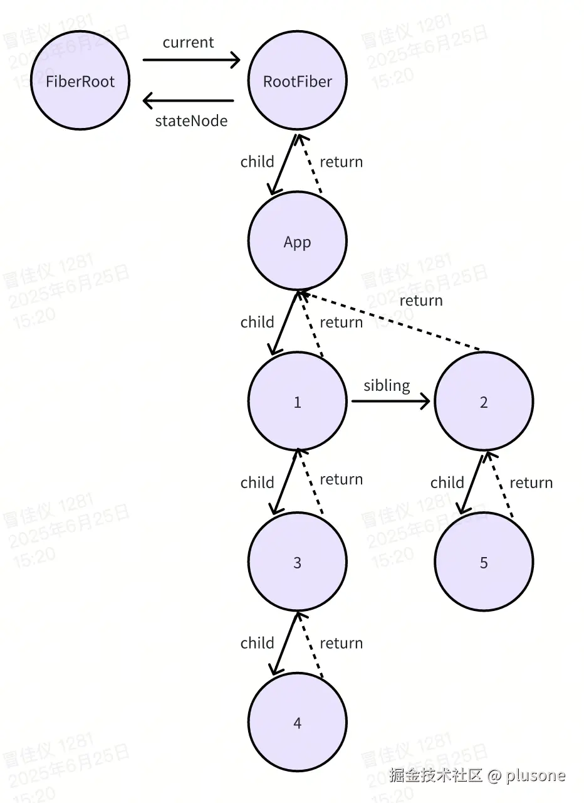

> [上一章](url)介绍了 React 中的调度流程，我们了解到不论是同步调度还是异步调度最终都会进入 `performWorkOnRoot` ，其中调用 `renderRoot` 和 `commitRoot`。区别是异步调度的 render 阶段可以中断，等浏览器空闲再从中断处继续执行。这章，我们来详细分析 React 中的 render 阶段做了什么。

同步模式和并发模式下，分别使用 `renderRootSync` 和 `renderRootConcurrent` 进行 Fiber 树的渲染。对比一下这两个流程：

# 同步和并发模式对比

精简后的源码如下：

## renderRootSync

```ts
function renderRootSync(root: FiberRoot, lanes: Lanes) {
  const prevExecutionContext = executionContext;
  executionContext |= RenderContext;
  const prevDispatcher = pushDispatcher();

  if (workInProgressRoot !== root || workInProgressRootRenderLanes !== lanes) {
    workInProgressTransitions = getTransitionsForLanes(root, lanes);
    prepareFreshStack(root, lanes);
  }

  do {
    try {
      workLoopSync();
      break;
    } catch (thrownValue) {
      handleError(root, thrownValue);
    }
  } while (true);
  resetContextDependencies();

  executionContext = prevExecutionContext;
  popDispatcher(prevDispatcher);

  workInProgressRoot = null;
  workInProgressRootRenderLanes = NoLanes;

  return workInProgressRootExitStatus;
}
```

## renderRootConcurrent

```ts
function renderRootConcurrent(root: FiberRoot, lanes: Lanes) {
  const prevExecutionContext = executionContext;
  executionContext |= RenderContext;
  const prevDispatcher = pushDispatcher();

  if (workInProgressRoot !== root || workInProgressRootRenderLanes !== lanes) {
    workInProgressTransitions = getTransitionsForLanes(root, lanes);
    resetRenderTimer();
    prepareFreshStack(root, lanes);
  }

  do {
    try {
      workLoopConcurrent();
      break;
    } catch (thrownValue) {
      handleError(root, thrownValue);
    }
  } while (true);
  resetContextDependencies();

  popDispatcher(prevDispatcher);
  executionContext = prevExecutionContext;

  if (workInProgress !== null) {
    return RootInProgress;
  } else {
    workInProgressRootRenderLanes = NoLanes;

    return workInProgressRootExitStatus;
  }
}
```

可以看出，`renderRootSync` 和 `renderRootConcurrent` 的实现基本一致，只有以下两处区别：

1. 同步渲染流程中调用 `workLoopSync`，其中不可中断；并发渲染流程中调用 `workLoopConcurrent`，其中可中断。

2. 同步渲染最后直接返回 `workInProgressRootExitStatus`。而并发渲染会根据 `workInProgress` 是否为 `null` 做差分：`workInProgress` 为 `null` 表示渲染完成，和同步渲染一样返回 `workInProgressRootExitStatus`；`workInProgress` 不为 `null` 表示中断渲染，并未完成，返回 `RootInProgress` 状态，后续不进入 commit 阶段。

下面我们将同步和并发渲染流程统称为 `renderRoot`，来解析一下它的实现。

# renderRoot

## 设置执行上下文

```ts
const prevExecutionContext = executionContext;
executionContext |= RenderContext;
```

### executionContext

先来了解一下 `executionContext`，它是一个全局变量，用于记录 React 当前正处于哪个阶段。状态枚举可以是下面这些：

```ts
export const NoContext = 0b0000;
export const BatchedContext = 0b0001;
export const EventContext = 0b0010;
export const RenderContext = 0b0100;
export const CommitContext = 0b1000;
```

也可以多个状态叠加，比如：

```ts
executionContext = EventContext | RenderContext;
```

再回来看 `renderRoot` 中的这段代码，做了两件事：

- 将开始渲染之前的执行上下文保存在 `prevExecutionContext` 中，以便渲染结束后恢复。

- 标记当前处于渲染阶段（`RenderContext`）。

## pushDispatcher

```ts
const prevDispatcher = pushDispatcher();
```

### Dispatcher

先来了解一下 `dispatcher` ，它是 React 中用来管理 hook 行为的代理。比如我们调用 `useState`，其实是在调用挂在 `dispatcher` 上的函数。

`dispatcher` 有几种：`ContextOnlyDispatcher`、`HooksDispatcherOnMount`、`HooksDispatcherOnUpdate`、`HooksDispatcherOnRerender`。

下面来看 `renderRoot` 中的 `pushDispatcher()`：

```ts
function pushDispatcher() {
  const prevDispatcher = ReactCurrentDispatcher.current;
  ReactCurrentDispatcher.current = ContextOnlyDispatcher;
  if (prevDispatcher === null) {
    return ContextOnlyDispatcher;
  } else {
    return prevDispatcher;
  }
}
```

将当前的 `ReactCurrentDispatcher.current` 记录在 `prevDispatcher` 全局变量上。

然后将 `ContextOnlyDispatcher` 绑定到 `ReactCurrentDispatcher.current` 上，`ContextOnlyDispatcher` 是一个只能读取 `useContext` 的 `dispatcher`，使用其它 hook 都会报错，它用于保护 React 内部一些 prepare 环节中 context 的预读取。

```ts
export const ContextOnlyDispatcher: Dispatcher = {
  readContext,

  useCallback: throwInvalidHookError,
  useContext: throwInvalidHookError,
  useEffect: throwInvalidHookError,
  useImperativeHandle: throwInvalidHookError,
  useInsertionEffect: throwInvalidHookError,
  useLayoutEffect: throwInvalidHookError,
  useMemo: throwInvalidHookError,
  useReducer: throwInvalidHookError,
  useRef: throwInvalidHookError,
  useState: throwInvalidHookError,
  useDebugValue: throwInvalidHookError,
  useDeferredValue: throwInvalidHookError,
  useTransition: throwInvalidHookError,
  useMutableSource: throwInvalidHookError,
  useSyncExternalStore: throwInvalidHookError,
  useId: throwInvalidHookError,

  unstable_isNewReconciler: enableNewReconciler,
};
```

后续在 `workLoop` 中真正进入渲染时会将 `ReactCurrentDispatcher.current` 赋值为其他几个 `dispatcher`（`HooksDispatcherOnMount`、`HooksDispatcherOnUpdate`、`HooksDispatcherOnRerender`），这样可以正常使用 hook。

最终在 `renderRoot` 结束前的 `popDispatcher()` 中将 `ReactCurrentDispatcher.current` 恢复为 `prevDispatcher`。

## prepareFreshStack

初始化 `workInProgress` Fiber 树，它是一个链表结构的树，用于构建本次渲染的新 UI。

### 触发条件

`prepareFreshStack` 不一定每次执行，存在以下触发条件：

```ts
if (workInProgressRoot !== root || workInProgressRootRenderLanes !== lanes) {
  prepareFreshStack(root, lanes);
}
```

- `workInProgressRoot`：当前正在渲染的 root。
- `workInProgressRootRenderLanes`：当前渲染的优先级。

如果本次调度的目标 root 和正在渲染的 root 不同，或本次调度的优先级和当前渲染的优先级不同，则需要调用 `prepareFreshStack` 重建 `workInProgress` Fiber 树，否则可以复用上次的 `workInProgress`，即**从中断处恢复执行**。

### 核心流程

```ts
function prepareFreshStack(root: FiberRoot, lanes: Lanes): Fiber {
  root.finishedWork = null;
  root.finishedLanes = NoLanes;

  if (workInProgress !== null) {
    let interruptedWork = workInProgress.return;
    while (interruptedWork !== null) {
      const current = interruptedWork.alternate;
      unwindInterruptedWork(
        current,
        interruptedWork,
        workInProgressRootRenderLanes
      );
      interruptedWork = interruptedWork.return;
    }
  }
  workInProgressRoot = root;
  const rootWorkInProgress = createWorkInProgress(root.current, null);
  workInProgress = rootWorkInProgress;
  workInProgressRootRenderLanes =
    subtreeRenderLanes =
    workInProgressRootIncludedLanes =
      lanes;
  workInProgressRootExitStatus = RootInProgress;
  workInProgressRootFatalError = null;
  workInProgressRootSkippedLanes = NoLanes;
  workInProgressRootInterleavedUpdatedLanes = NoLanes;
  workInProgressRootRenderPhaseUpdatedLanes = NoLanes;
  workInProgressRootPingedLanes = NoLanes;
  workInProgressRootConcurrentErrors = null;
  workInProgressRootRecoverableErrors = null;

  enqueueInterleavedUpdates();

  return rootWorkInProgress;
}
```

#### 1. 清理上次 render 的结果

`finishedWork`：上一次渲染完成后的 Fiber 树。

`finishedLanes`：上次完成渲染的优先级。

将它们清空以避免误用。

#### 2. unwind

`workInProgress` 不为 `null`，即上次 render 中断的情况，新的渲染开始前，需要做一次 `unwind` 清理，清理上次未完成的状态和副作用。

此处从 `workInProgress.return` 即上次中断节点的父节点开始，逐层向上回溯整个 Fiber 树。通过 `interruptedWork.alternate` 获取旧的 Fiber 节点（之前介绍过[alternate](url)属性，涉及 Fiber 树的双缓存结构），和新的 Fiber 节点一起传入 `unwindInterruptedWork()`。

`unwindInterruptedWork()` 是核心清理函数，它的作用包括：

- 清除 context 栈。
- 清除 effect 栈。

#### 3. 设置渲染根节点

设置当前正在 render 的根节点。

```ts
workInProgressRoot = root;
```

全局变量 `workInProgressRoot` 表示当前正在构建的 Fiber 树所挂载的 `FiberRoot`。

#### 4. createWorkInProgress

基于 `current` Fiber 树，创建 `workInProgress` Fiber 树。

> **前置知识**：
>
> `current` 表示当前展示的 Fiber 树。`workInProgress` 表示本轮渲染正在构建的新 Fiber 树。
>
> `current.alternate === workInProgress`
>
> `workInProgress.alternate === current`
>
> 它们的每一个节点都通过 `alternate` 互相指向，形成双缓冲结构，这种相互指向的关系在创建 Fiber 节点的时候建立，马上就会讲到。

```ts
export function createWorkInProgress(current: Fiber, pendingProps: any): Fiber {
  let workInProgress = current.alternate;
  if (workInProgress === null) {
    workInProgress = createFiber(
      current.tag,
      pendingProps,
      current.key,
      current.mode
    );
    workInProgress.elementType = current.elementType;
    workInProgress.type = current.type;
    workInProgress.stateNode = current.stateNode;

    workInProgress.alternate = current;
    current.alternate = workInProgress;
  } else {
    workInProgress.pendingProps = pendingProps;
    workInProgress.type = current.type;

    workInProgress.flags = NoFlags;

    workInProgress.subtreeFlags = NoFlags;
    workInProgress.deletions = null;
  }

  workInProgress.flags = current.flags & StaticMask;
  workInProgress.childLanes = current.childLanes;
  workInProgress.lanes = current.lanes;

  workInProgress.child = current.child;
  workInProgress.memoizedProps = current.memoizedProps;
  workInProgress.memoizedState = current.memoizedState;
  workInProgress.updateQueue = current.updateQueue;

  const currentDependencies = current.dependencies;
  workInProgress.dependencies =
    currentDependencies === null
      ? null
      : {
          lanes: currentDependencies.lanes,
          firstContext: currentDependencies.firstContext,
        };

  workInProgress.sibling = current.sibling;
  workInProgress.index = current.index;
  workInProgress.ref = current.ref;

  return workInProgress;
}
```

**参数**：

传入的 `current` 为 `FiberRoot.current` 即 `RootFiber` 节点。

**实现**：

1. 通过 `RootFiber.alternate` 检查它是否已有 `workInProgress`。

2. 如果没有就通过 `createFiber()` 新建，**并建立 `workInProgress` 和 `current` 的双向引用关系**。

3. 如果有就复用已有的 `workInProgress`，并重置之前的副作用和标记等。

4. 保留上轮的子节点、兄弟节点、缓存 props、state、更新队列、context 依赖等。

5. 返回构建好的 `workInProgress`。

> 可以看出 `createWorkInProgress()` 不会完全重新构建树，而是会尽量复用结构，只初始化部分字段。

#### 5. 设置 workInProgress 指针

将 `workInProgress` 全局变量指向 `createWorkInProgress()` 创建的 Fiber 树。

```ts
workInProgress = rootWorkInProgress;
```

#### 6. 设置本次渲染优先级

设置本次渲染的优先级，赋值到 `workInProgressRootRenderLanes` 全局变量上。

#### 7. 标记渲染状态

将 `RootInProgress` 赋值给 `workInProgressRootExitStatus` 全局变量，标记当前为**渲染进行**状态。`renderRoot` 如果返回这个状态，表示没有渲染完成，不会触发后续的 commit 阶段。

```ts
workInProgressRootExitStatus = RootInProgress;
```

#### 8. 清除各种全局临时状态

#### 9. 返回新构建的 Fiber 树

即 `createWorkInProgress()` 创建的 `workInProgress`。

## workLoop

`workLoop` 是 React Fiber 构建的主循环函数，用于循环构建 `workInProgress` 树，分为同步 `workLoopSync` 和并发 `workLoopConcurrent`。二者本质都是循环执行 `performUnitOfWork(workInProgress)`，直至整棵 Fiber 树构建完毕。唯一的区别是 `workLoopSync` 不可中断，而 `workLoopConcurrent` 可以通过 `shouldYield()` 判断时间片结束并中断。

```ts
function workLoopSync() {
  while (workInProgress !== null) {
    performUnitOfWork(workInProgress);
  }
}
```

```ts
function workLoopConcurrent() {
  while (workInProgress !== null && !shouldYield()) {
    performUnitOfWork(workInProgress);
  }
}
```

这里的 `workInProgress` 是一个全局变量，指针指向当前正在处理的 Fiber 节点，如果是中断后继续执行就是中断的节点，否则就是 `RootFiber` 节点（即上一步调用 `prepareFreshStack` 构建的）。

关于 `performUnitOfWork` 的实现，我们后面再看。

## handleError

`workLoop` 中报错会通过 `try...catch...` 进入 `handleError` ，其中会捕获错误，寻找错误边界并重渲染，具体实现后面讲。

```ts
do {
  try {
    workLoopConcurrent();
    break;
  } catch (thrownValue) {
    handleError(root, thrownValue);
  }
} while (true);
```

## 清理上下文

```ts
resetContextDependencies();
popDispatcher(prevDispatcher);
executionContext = prevExecutionContext;
```

**1. `resetContextDependencies` 清空全局的 context 依赖链**

```ts
export function resetContextDependencies() {
  currentlyRenderingFiber = null;
  lastContextDependency = null;
  lastFullyObservedContext = null;
}
```

这些全局状态是在渲染过程中临时存储的，用于追踪 `useContext` 的依赖，渲染完成后清空。

**2. `popDispatcher` 恢复 dispatcher**

```ts
function popDispatcher(prevDispatcher) {
  ReactCurrentDispatcher.current = prevDispatcher;
}
```

将 `ReactCurrentDispatcher.current` 恢复为开始渲染前的 dispatcher。

**3. 恢复 `executionContext` 执行上下文**

`renderRoot` 开始时，将执行上下文标记为渲染阶段（`RenderContext`），此处恢复为开始渲染前的上下文。

## 返回渲染状态

返回当前渲染阶段的退出状态码，这个状态决定是否继续执行 commit 阶段。

```ts
if (workInProgress !== null) {
  return RootInProgress;
} else {
  workInProgressRootRenderLanes = NoLanes;

  return workInProgressRootExitStatus;
}
```

例如：

```ts
export const RootIncomplete = 0;
export const RootErrored = 1;
export const RootSuspended = 2;
export const RootSuspendedWithDelay = 3;
export const RootCompleted = 5;
export const RootDidNotComplete = 6;
```

- `RootInProgress`：并发渲染中断时返回，不会进入 commit 阶段。

- `RootCompleted`：`performUnitOfWork` -> `completeUnitOfWork` 中赋值，可以进入 commit 阶段。

# workLoop

`workLoop` 和 `workLoopConcurrent` 中循环执行 `performUnitOfWork`，它是负责执行一个 Fiber 节点的工作单元。

```ts
function workLoopConcurrent() {
  while (workInProgress !== null && !shouldYield()) {
    performUnitOfWork(workInProgress);
  }
}
```

```ts
function performUnitOfWork(unitOfWork: Fiber) {
  const current = unitOfWork.alternate;
  let next;

  next = beginWork(current, unitOfWork, renderLanes);

  unitOfWork.memoizedProps = unitOfWork.pendingProps;

  if (next === null) {
    completeUnitOfWork(unitOfWork);
  } else {
    workInProgress = next;
  }
}
```

**参数**：

- `unitOfWork`：当前正在构建的 Fiber 节点。

**整体流程**：

1. `beginWork` 负责构建当前节点的子 Fiber 节点，并返回**第一个** `child`。

2. 如果存在 `child` 就在 `workLoop` 循环中**顺着 Fiber 树的一侧向下构建** `workInProgress` 树，直到叶子节点。

3. 如果一侧子节点为 `null` 了，就调用 `completeUnitOfWork` 进入**向上回溯**阶段，收集 effect 副作用。

4. `completeUnitOfWork` 中也有一个循环：

- 如果传入的 Fiber 节点没有 `sibling`（兄弟节点），就通过 `return` 一路向上收集副作用链，直到没有 `return` 即回到了 `FiberRoot` 节点，完成 `workLoop` 大循环，也完成了 render 阶段，后续会进入 commit 阶段。
- 如果传入的 Fiber 节点有 `sibling` 就将 `workInProgress` 指向 `sibling` 节点，结束 `completeUnitOfWork` 循环，然后重新进入 `workLoop` 循环，对这个 `sibling` 节点再次开始一路向下的 `beginWork` 创建过程。

---

举个例子，对于下图这棵 Fiber 树，它在 `workLoop` 循环中创建的过程大概是这样：



```ts
performUnitOfWork(RootFiber) -> beginWork(RootFiber) -> 创建 App，返回 App

performUnitOfWork(App) -> beginWork(App) -> 创建 1 和 2，返回 1

performUnitOfWork(1) -> beginWork(1) -> 创建 3，返回 3

performUnitOfWork(3) -> beginWork(3) -> 创建 4，返回 4

performUnitOfWork(4) -> beginWork(4) -> 返回 null

completeUnitOfWork(4) -> 4 没有 sibling，return 为 3 -> completeUnitOfWork(3) -> 3 没有 sibling，return 为 1 -> completeUnitOfWork(1) -> 1 有 sibling 为 2，跳出 completeUnitOfWork 循环，重新进入 workLoop 循环

performUnitOfWork(2) -> beginWork(2) -> 创建 5，返回 5

performUnitOfWork(5) -> beginWork(5) -> 返回 null

completeUnitOfWork(5) -> 5 没有 sibling，return 为 2 -> completeUnitOfWork(2) -> 2 没有 sibling，return 为 App -> completeUnitOfWork(App) -> App 没有 sibling，return 为 RootFiber -> completeUnitOfWork(RootFiber) -> RootFiber 没有 sibling，return 为 null -> 结束 completeUnitOfWork 循环

workInProgress 为 null，结束 workLoop 循环，完成 render 阶段
```

---

下面详细分析下 `beginWork` 和 `completeUnitOfWork` 的实现。

## beginWork

**向下构建阶段**：构建当前节点的子 Fiber 节点，并返回第一个 `child`。用于在 `workLoop` 循环中构建子树，直到最深的叶子节点。

```ts
function beginWork(
  current: Fiber | null,
  workInProgress: Fiber,
  renderLanes: Lanes,
): Fiber | null {
  if (current !== null) {
    const oldProps = current.memoizedProps;
    const newProps = workInProgress.pendingProps;

    if (
      oldProps !== newProps ||
      hasLegacyContextChanged()
    ) {
      didReceiveUpdate = true;
    } else {
      const hasScheduledUpdateOrContext = checkScheduledUpdateOrContext(
        current,
        renderLanes,
      );
      if (
        !hasScheduledUpdateOrContext &&
        (workInProgress.flags & DidCapture) === NoFlags
      ) {
        didReceiveUpdate = false;
        return attemptEarlyBailoutIfNoScheduledUpdate(
          current,
          workInProgress,
          renderLanes,
        );
      }
      if ((current.flags & ForceUpdateForLegacySuspense) !== NoFlags) {
        didReceiveUpdate = true;
      } else {
        didReceiveUpdate = false;
      }
    }
  } else {
    didReceiveUpdate = false;
  }

  workInProgress.lanes = NoLanes;

  switch (workInProgress.tag) {
    case IndeterminateComponent:
      return mountIndeterminateComponent(...);
    case FunctionComponent:
      return updateFunctionComponent(...);
    case ClassComponent:
      return updateClassComponent(...);
    case HostRoot:
      return updateHostRoot(...);
    case HostComponent:
      return updateHostComponent(...);
    case HostText:
      return updateHostText(...);
    ...
  }
}

```

**参数**：

- `current`：旧 Fiber 节点，从当前正在处理的 `workInProgress.alternate` 上获取。
- `workInProgress`：当前正在处理的新 Fiber 节点。
- `renderLanes`：本次渲染优先级。

**实现**：

分为两大块：bailout 和 update。

### bailout 性能优化

React 中 bailout 策略用于跳过子节点或直接跳过整棵子树的更新。有两种程度的 bailout：

- 优化程度高的 bailout 会跳过整棵子树的更新。

- 优化程度低的 bailout 仅复用子节点，不跳过整棵子树。

整个 render 流程中，有两次 bailout 机会。引起 Fiber 节点变化的因素包括：props、context、update 更新等，这两次 bailout 机会的判断也围绕这几点展开。

#### 第一次 bailout 机会

**判断时机**：

`beginWork` 中，进入各类型节点 update 流程之前。

**判断条件**：

1. 非首次更新，即 `current !== null`，`current` 为旧的 Fiber 节点，存在则非首次更新。

2. props 没变，比较 `oldProps` 和 `newProps`。

3. context 没变。

4. 当前 Fiber 节点没有 update 更新。

5. 节点上没有 `DidCapture` 错误捕获标记，即不是 `ErrorBoundary`、`Suspense`。

条件都满足则命中 bailout 策略，执行 `attemptEarlyBailoutIfNoScheduledUpdate` -> `bailoutOnAlreadyFinishedWork`，其中决定优化程度。

##### bailoutOnAlreadyFinishedWork

```ts
function bailoutOnAlreadyFinishedWork(
  current: Fiber | null,
  workInProgress: Fiber,
  renderLanes: Lanes
): Fiber | null {
  if (current !== null) {
    workInProgress.dependencies = current.dependencies;
  }

  markSkippedUpdateLanes(workInProgress.lanes);

  if (!includesSomeLane(renderLanes, workInProgress.childLanes)) {
    return null;
  }

  cloneChildFibers(current, workInProgress);
  return workInProgress.child;
}
```

1. 进入 `bailoutOnAlreadyFinishedWork` 时已经确定**至少当前组件不需要执行 update，可以复用子节点**。所以使用 `markSkippedUpdateLanes` 标记当前 Fiber 的更新优先级为「被跳过」。

2. 检查子树是否也可以跳过：通过 `workInProgress.childLanes`（当前节点所有子节点优先级的集合）和 `renderLanes` （本次渲染优先级）的比较来判断子树是否存在更新，如果不存在更新，则直接 `return null` 结束向下的 `beginWork` ，开始 `completeUnitOfWork` 向上回溯，即跳过整个子树的更新。【高程度优化】

3. 如果子树存在更新，则 `cloneChildFibers` 复用子节点，仅跳过当前组件的 update，然后返回子节点继续向下 `beginWork`。【低程度优化】

#### 第二次 bailout 机会

**判断时机**：

第一次 bailout 没有命中，根据 `workInProgress.tag` 进入各节点 update 逻辑，其中部分类型节点还有第二次 bailout 判断。

比如在 `updateFunctionComponent` 里：

```ts
function updateFunctionComponent(...) {
  ...
  nextChildren = renderWithHooks(...);

  if (current !== null && !didReceiveUpdate) {
    bailoutHooks(current, workInProgress, renderLanes);
    return bailoutOnAlreadyFinishedWork(current, workInProgress, renderLanes);
  }

  workInProgress.flags |= PerformedWork;
  reconcileChildren(current, workInProgress, nextChildren, renderLanes);
  return workInProgress.child;
}
```

**判断条件**：

**1. 非首次更新**

即 `current !== null`。

**2. 全局变量 `didReceiveUpdate` 为 `false`**

`didReceiveUpdate` 字段什么情况会是 `false` 呢？

1）组件中使用了性能优化 API，比如函数组件使用了 `React.memo`，或者类组件使用了 `shouldComponentUpdate`、`PureComponent` 这些。

```ts
function updateSimpleMemoComponent() {
  ...
  if (current !== null) {
    const prevProps = current.memoizedProps;
    if (
      shallowEqual(prevProps, nextProps) &&
      current.ref === workInProgress.ref &&
    ) {
      didReceiveUpdate = false;
    }
  }
}
```

在 `updateSimpleMemoComponent` 中，`shallowEqual` 比较新旧 props 没有变化，则标记 `didReceiveUpdate = false`。

2）当前节点有更新，但更新前后 state 没有发生变化。

这个场景可以看 `beginWork` 开头第一次 bailout 判断那里，**props 没变、context 没变、但当前节点有 update 更新**的情况下，不确定这个更新是否会使 state 发生变化。所以会先「假设」`didReceiveUpdate = false`，然后在 `updateFunctionComponent` -> `renderWithHooks` -> 执行 hook `updateReducer`，其中判断更新前后 state 是否变化，变化则赋值 `didReceiveUpdate = true`，没变则 `didReceiveUpdate` 保持初设值 `false`，命中第二次 bailout。

```ts
function updateReducer(...) {
  ...
  if (!is(newState, hook.memoizedState)) {
    markWorkInProgressReceivedUpdate();
  }
  ...
}
```

```ts
export function markWorkInProgressReceivedUpdate() {
  didReceiveUpdate = true;
}
```

### 各类型节点 update

根据当前节点类型（`workInProgress.tag`），调用对应的更新逻辑，生成或复用子 Fiber 节点。

常见的节点类型有这些：

- `HostRoot`：RootFiber 节点。
- `FunctionComponent`：函数组件。
- `ClassComponent`：类组件。
- `HostComponent`：原生 DOM 元素。
- `HostText`：文本节点。

下面来看不同类型节点如何 update。

#### updateHostRoot

处理 RootFiber 节点的更新。

精简后的代码如下：

```ts

function updateHostRoot(current, workInProgress, renderLanes) {
  ...

  const nextProps = workInProgress.pendingProps;
  const prevState = workInProgress.memoizedState;
  const prevChildren = prevState.element;
  cloneUpdateQueue(current, workInProgress);
  processUpdateQueue(workInProgress, nextProps, null, renderLanes);

  const nextState: RootState = workInProgress.memoizedState;
  const root: FiberRoot = workInProgress.stateNode;

  const nextChildren = nextState.element;

  ...

  reconcileChildren(current, workInProgress, nextChildren, renderLanes);

  return workInProgress.child;
}
```

##### update 对象

解析 RootFiber 的更新流程之前，我们先来回顾下根节点的 `update` 对象。

在[【React18 源码解析】（二）创建更新&触发调度](url)中我们讲过初次渲染 `root.render()` 时创建的 `update` 对象：

```ts
ReactDOMRoot.prototype.render = function (children) {
  const root = this._internalRoot;
  updateContainer(children, root, null, null);
};
```

```ts
export function updateContainer(element, root) {
  ...
  const update = createUpdate(eventTime, lane);
  update.payload = { element };

  enqueueUpdate(current, update, lane);
  ...
}
```

`update.payload` 上的 `element` 就是传入 `root.render()` 的根组件，一般是 `<App />` 组件。

这个 `update` 对象会通过 [`enqueueUpdate`](url) 放到 RootFiber 节点的 `updateQueue` 的 `shared.pending` 链表结构中。

```ts
type UpdateQueue<State> = {
  baseState: State;
  firstBaseUpdate: Update<State> | null;
  lastBaseUpdate: Update<State> | null;
  shared: {
    pending: Update<State> | null;
  };
  effects: Array<Update<State>> | null;
};
```

##### cloneUpdateQueue

从 `current` 拷贝一份 `updateQueue` 到 `workInProgress`。

目的：双缓冲机制，保证 `workInProgress` 的更新不影响原来的 `current`。

##### processUpdateQueue

依次处理 `updateQueue` 中所有 `update`，根据当前渲染优先级（`renderLanes`）决定执行那些 `update`，跳过哪些 `update`，最终计算出新的 `memoizedState` 等。

```ts
export function processUpdateQueue<State>(
  workInProgress: Fiber,
  props: any,
  instance: any,
  renderLanes: Lanes,
): void {
  const queue: UpdateQueue<State> = (workInProgress.updateQueue: any);

  hasForceUpdate = false;

  let firstBaseUpdate = queue.firstBaseUpdate;
  let lastBaseUpdate = queue.lastBaseUpdate;

  let pendingQueue = queue.shared.pending;
  if (pendingQueue !== null) {
    queue.shared.pending = null;

    const lastPendingUpdate = pendingQueue;
    const firstPendingUpdate = lastPendingUpdate.next;
    lastPendingUpdate.next = null;
    if (lastBaseUpdate === null) {
      firstBaseUpdate = firstPendingUpdate;
    } else {
      lastBaseUpdate.next = firstPendingUpdate;
    }
    lastBaseUpdate = lastPendingUpdate;

    const current = workInProgress.alternate;
    if (current !== null) {
      const currentQueue: UpdateQueue<State> = (current.updateQueue: any);
      const currentLastBaseUpdate = currentQueue.lastBaseUpdate;
      if (currentLastBaseUpdate !== lastBaseUpdate) {
        if (currentLastBaseUpdate === null) {
          currentQueue.firstBaseUpdate = firstPendingUpdate;
        } else {
          currentLastBaseUpdate.next = firstPendingUpdate;
        }
        currentQueue.lastBaseUpdate = lastPendingUpdate;
      }
    }
  }

  if (firstBaseUpdate !== null) {
    let newState = queue.baseState;
    let newLanes = NoLanes;

    let newBaseState = null;
    let newFirstBaseUpdate = null;
    let newLastBaseUpdate = null;

    let update = firstBaseUpdate;
    do {
      const updateLane = update.lane;
      const updateEventTime = update.eventTime;
      if (!isSubsetOfLanes(renderLanes, updateLane)) {
        const clone: Update<State> = {
          eventTime: updateEventTime,
          lane: updateLane,

          tag: update.tag,
          payload: update.payload,
          callback: update.callback,

          next: null,
        };
        if (newLastBaseUpdate === null) {
          newFirstBaseUpdate = newLastBaseUpdate = clone;
          newBaseState = newState;
        } else {
          newLastBaseUpdate = newLastBaseUpdate.next = clone;
        }
        newLanes = mergeLanes(newLanes, updateLane);
      } else {
        if (newLastBaseUpdate !== null) {
          const clone: Update<State> = {
            eventTime: updateEventTime,
            lane: NoLane,

            tag: update.tag,
            payload: update.payload,
            callback: update.callback,

            next: null,
          };
          newLastBaseUpdate = newLastBaseUpdate.next = clone;
        }

        newState = getStateFromUpdate(
          workInProgress,
          queue,
          update,
          newState,
          props,
          instance,
        );
        const callback = update.callback;
        if (
          callback !== null &&
          update.lane !== NoLane
        ) {
          workInProgress.flags |= Callback;
          const effects = queue.effects;
          if (effects === null) {
            queue.effects = [update];
          } else {
            effects.push(update);
          }
        }
      }
      update = update.next;
      if (update === null) {
        pendingQueue = queue.shared.pending;
        if (pendingQueue === null) {
          break;
        } else {
          const lastPendingUpdate = pendingQueue;
          const firstPendingUpdate = ((lastPendingUpdate.next: any): Update<State>);
          lastPendingUpdate.next = null;
          update = firstPendingUpdate;
          queue.lastBaseUpdate = lastPendingUpdate;
          queue.shared.pending = null;
        }
      }
    } while (true);

    if (newLastBaseUpdate === null) {
      newBaseState = newState;
    }

    queue.baseState = ((newBaseState: any): State);
    queue.firstBaseUpdate = newFirstBaseUpdate;
    queue.lastBaseUpdate = newLastBaseUpdate;

    workInProgress.lanes = newLanes;
    workInProgress.memoizedState = newState;
  }
}
```

**1. 变量准备**

- `firstBaseUpdate` / `lastBaseUpdate`：之前没被处理的更新（比如低优先级更新）。

- `pendingQueue`：`updateQueue.shared.pending`，本次 render 周期新增的更新。

**2. 整合 `pendingQueue` 到 `lastBaseUpdate` 之后**

之前在介绍 [`updateQueue` 结构](url)时有介绍过，值得注意的是 `pendingQueue` 是一个循环链表，需要断开 `next` 再接到 `lastBaseUpdate` 之后。

同时也同步一份到 `current.updateQueue`，保持双缓冲一致性。

**3. 遍历 `update` 链，处理符合优先级的更新**

- 遍历整合好的 `firstBaseUpdate` 链表。

- 优先级没命中的 `update`（`!isSubsetOfLanes(renderLanes, updateLane)`），跳过，放入 `baseUpdate` 下次再处理。

- 优先级命中的 `update`，执行更新，调用 `getStateFromUpdate` 计算新的 state。`getStateFromUpdate` 会根据 `update.tag` 类型不同分别处理：

  - `ReplaceState`：完全替换。

  - `UpdateState`：合并 partial state，RootFiber 的更新中 `partialState = update.payload = { element: <App /> }`，则更新后的 state 为 `{ element: <App /> }`。

  - `ForceUpdate`：不变，但触发重新渲染。

```ts
function getStateFromUpdate<State>(
  workInProgress: Fiber,
  queue: UpdateQueue<State>,
  update: Update<State>,
  prevState: State,
  nextProps: any,
  instance: any
): any {
  switch (update.tag) {
    case ReplaceState: {
      const payload = update.payload;
      if (typeof payload === "function") {
        const nextState = payload.call(instance, prevState, nextProps);
        return nextState;
      }
      return payload;
    }
    case CaptureUpdate: {
      workInProgress.flags =
        (workInProgress.flags & ~ShouldCapture) | DidCapture;
    }
    case UpdateState: {
      const payload = update.payload;
      let partialState;
      if (typeof payload === "function") {
        partialState = payload.call(instance, prevState, nextProps);
      } else {
        partialState = payload;
      }
      if (partialState === null || partialState === undefined) {
        return prevState;
      }
      return assign({}, prevState, partialState);
    }
    case ForceUpdate: {
      hasForceUpdate = true;
      return prevState;
    }
  }
  return prevState;
}
```

**4. 写回更新后的结果**

将更新后新的 `memoizedState`、`firstBaseUpdate`、`lastBaseUpdate` 等写到 `workInProgress` 节点上。

##### 获取 nextChildren 虚拟 DOM

上一步说到 RootFiber 更新后的 `memoizedState` 为 `{ element: <App /> }`，那么就可以从 `memoizedState.element` 拿到 `nextChildren` 了，它是子节点的虚拟 DOM。

```ts
const nextState: RootState = workInProgress.memoizedState;
const nextChildren = nextState.element;
```

**虚拟 DOM 本质上是一个对象**，比如 `<App />` 编译后为 `React.createElement(App, null)`，执行得到一个对象结构如下，这个**对象的 `type` 属性为组件本体**。

```ts
{
  $$typeof: Symbol(react.element),
  type: App, // 组件本体
  key: null,
  props: {},
}
```

##### reconcile

子节点的虚拟 dom（`nextChildren`）会通过 `reconcile` 变成子 Fiber 节点，挂在当前节点的 `workInProgress.child` 上。

```ts
reconcileChildren(current, workInProgress, nextChildren, renderLanes);
```

`reconcile` 中会做新旧虚拟 DOM 的 diff，能复用的尽量复用，不能复用的新创建。

比如调用 `createFiberFromElement` 从虚拟 DOM 创建 Fiber 节点，参数 `element` 就是上面提到的虚拟 DOM 对象。`fiber.type` 为 `element.type` 即**组件本体**，比如 App 函数、class 或 DOM 字符串等。

```ts
// JSX → Fiber 的桥梁函数
function createFiberFromElement(element, mode, lanes) {
  const { type, key, props } = element;

  let fiberTag = FunctionComponent; // Fiber 类型，此处假设是函数组件

  const fiber = createFiber(fiberTag, props, key, mode);

  fiber.elementType = type;
  fiber.type = type;

  fiber.lanes = lanes;
  return fiber;
}
```

`reconcile` 中只会复用或创建子 Fiber 节点，对增、删、改标记副作用，在 commit 阶段统一处理，以减少对真实 DOM 的操作。具体实现我们到下一章再讲。

##### 返回构建好的子 Fiber 节点

即 `return workInProgress.child` 。

#### updateFunctionComponent

处理函数组件的更新。

```ts
case FunctionComponent:
    const Component = workInProgress.type;
    const resolvedProps = workInProgress.pendingProps;
    return updateFunctionComponent(
        current,
        workInProgress,
        Component,
        resolvedProps,
        renderLanes,
    );
```

```ts
function updateFunctionComponent(
  current,
  workInProgress,
  Component,
  nextProps: any,
  renderLanes
) {
  let nextChildren;

  nextChildren = renderWithHooks(
    current,
    workInProgress,
    Component,
    nextProps,
    context,
    renderLanes
  );

  if (current !== null && !didReceiveUpdate) {
    bailoutHooks(current, workInProgress, renderLanes);
    return bailoutOnAlreadyFinishedWork(current, workInProgress, renderLanes);
  }

  workInProgress.flags |= PerformedWork;
  reconcileChildren(current, workInProgress, nextChildren, renderLanes);
  return workInProgress.child;
}
```

**参数**：

- `current`：旧 Fiber 节点。

- `workInProgress`：当前正在处理的新 Fiber 节点。

- `Component`：**函数组件本体，从 `workInProgress.type` 获取，虚拟 DOM 的 `type` 属性**（上面刚讲过）。

- `nextProps`: 最新的 props。

- `renderLanes`：本次渲染优先级。

**实现**：

**1. 执行组件函数 + hooks**

```ts
export function renderWithHooks(...) {
  ...
  let children = Component(props, secondArg);
  ...
  return children;
}
```

调用 `Component` ，即执行函数组件的函数体，其中会执行 hooks，返回函数组件 return 的虚拟 DOM 赋值给 `nextChildren`。

**2. 尝试 bailout**

第二次 bailout 机会，前面讲过了。

**3. reconcile**

将虚拟 DOM 转为子 Fiber 节点，挂到 `workInProgress.child`。

**4. 返回构建好的子 Fiber 节点**

#### updateHostComponent

处理原生 DOM 元素对应 Fiber 的更新。

```ts
function updateHostComponent(
  current: Fiber | null,
  workInProgress: Fiber,
  renderLanes: Lanes
) {
  const type = workInProgress.type;
  const nextProps = workInProgress.pendingProps;
  const prevProps = current !== null ? current.memoizedProps : null;

  let nextChildren = nextProps.children;
  const isDirectTextChild = shouldSetTextContent(type, nextProps);

  if (isDirectTextChild) {
    nextChildren = null;
  } else if (prevProps !== null && shouldSetTextContent(type, prevProps)) {
    workInProgress.flags |= ContentReset;
  }

  reconcileChildren(current, workInProgress, nextChildren, renderLanes);
  return workInProgress.child;
}
```

**1. 获取类型和 props**

- `type`：从 `workInProgress.type` 获取，虚拟 DOM 的 `type` 属性，此处为 DOM 字符串，比如 `"div"`、`"span"`。

- `nextProps`：新 props。

- `prevProps`：旧 props。

**2. 判断是不是纯文本节点**

```ts
function shouldSetTextContent(type: string, props: Props): boolean {
  return (
    typeof props.children === "string" || typeof props.children === "number"
  );
}
```

即 DOM 元素的 `children` 直接为字符串或数值，没有任何 `ReactElement`，比如 `<div>hello</div>`。

- 如果是纯文本节点：设置 `nextChildren = null`，即没有子 Fiber 节点。**注意，这里 React 不会为纯文本 `hello` 创建 `HostText` 类型的 Fiber，而是直接由宿主环境（DOM）在后续 `completeUnitOfWork` -> `completWork` 中设置设置 `.textContent`，会更高效**。

- 如果不是纯文本节点：设置 `nextChildren = nextProps.children`，即 DOM 元素的 `children`。

- 如果上次是纯文本节点，这次不是：在 `workInProgress` 上标记 `ContentReset` 副作用，告诉 commit 阶段要先清空原来的 `textContent`。

**3. reconcile**

将虚拟 DOM 转为子 Fiber 节点，挂到 `workInProgress.child`。

在纯文本节点的情况下，传入的 `nextChildren` 为 `null`，会删除当前节点的所有子节点，将 `workInProgress.child` 赋值为 `null`。

**4. 返回构建好的子 Fiber 节点**

#### updateHostText

处理文本节点的更新。

##### 什么时候创建 HostText

> 看到这里你可能有个疑问，前面刚刚提到不会为纯文本创建 `HostText` 类型的 Fiber，那这里要处理的 `HostText` 是怎么来的？

其实 react 只是对纯文本子节点不会创建 `HostText`，但如果文本节点是**在多个子元素中出现**或**通过表达式产生**，则是会创建的。

比如这样不会创建 `HostText`：

```ts
<div>Hello</div>
```

但这样会创建（在多个子元素中出现）：

```tsx
<div>
  Hello {/* HostText Fiber */}
  <span>world</span> {/* HostComponent Fiber */}
</div>
```

这样也会创建（通过表达式产生）：

```ts
<div>{count}</div>
```

##### 实现

```ts
function updateHostText(
  current: Fiber | null,
  workInProgress: Fiber
): Fiber | null {
  if (current === null) {
    // 初次挂载 HostText，不做特殊处理，completeWork 会创建 text node
  } else {
    const oldText = current.memoizedProps;
    const newText = workInProgress.pendingProps;
    if (oldText !== newText) {
      markUpdate(workInProgress);
    }
  }
  return null;
}
```

1. 首次挂载什么都不做，后续在 `completeWork` 中会去创建真实 DOM 文本节点。

2. 非首次，比较新旧文本内容，变化了就调用 `markUpdate` 标记 `Update` 副作用，后续在 commit 阶段进行处理。

3. 返回 `null`，结束向下的 `beginWork`。

## completeUnitOfWork

**向上回溯阶段**：用于标记和收集副作用、创建 DOM。

精简后的源码如下：

```ts
function completeUnitOfWork(unitOfWork: Fiber): void {
  let completedWork = unitOfWork;
  do {
    const current = completedWork.alternate;
    const returnFiber = completedWork.return;

    if ((completedWork.flags & Incomplete) === NoFlags) {
      completeWork(current, completedWork, subtreeRenderLanes);
    } else {
      const next = unwindWork(current, completedWork, subtreeRenderLanes);

      if (next !== null) {
        next.flags &= HostEffectMask;
        workInProgress = next;
        return;
      }

      if (returnFiber !== null) {
        returnFiber.flags |= Incomplete;
        returnFiber.subtreeFlags = NoFlags;
        returnFiber.deletions = null;
      } else {
        workInProgressRootExitStatus = RootDidNotComplete;
        workInProgress = null;
        return;
      }
    }

    const siblingFiber = completedWork.sibling;
    if (siblingFiber !== null) {
      workInProgress = siblingFiber;
      return;
    }
    completedWork = returnFiber;
    workInProgress = completedWork;
  } while (completedWork !== null);

  if (workInProgressRootExitStatus === RootInProgress) {
    workInProgressRootExitStatus = RootCompleted;
  }
}
```

1. 进入 `do...while...` 循环。

2. 节点上没有 `Incomplete` 标识，为非报错情况，调用 `completeWork`。【`beginWork` 返回 `null` 以后调用 `completeUnitOfWork` 进入的分支】

3. 节点上有 `Incomplete` 标识，为报错情况，调用 `unwindWork`。【`handleError` 中调用 `completeUnitOfWork` 进入的分支】

4. 当前处理的节点有 `sibling`，将 `workInProgress` 全局变量设置为 `sibling` 节点，结束 `completeUnitOfWork` 循环，回到 `workLoop` -> `beginWork` 继续处理。

5. 当前处理的节点没有 `sibling`，取 `return` 向上回溯父节点，直到 `FiberRoot` 为止。

6. **如果是回到 `FiberRoot` 才结束的循环，表示 render 阶段完成**，标记渲染状态 `workInProgressRootExitStatus = RootCompleted`，之后可进入 commit 阶段。

### completeWork

用于完成一个 Fiber 单元。其中包括 DOM 元素创建、连接子 DOM 元素、标记和收集副作用等。

精简后的源码如下：

```ts
function completeWork(current, workInProgress, renderLanes) {
  switch (workInProgress.tag) {
    case HostComponent: {
      ...
      if (current === null) {
        // 初次挂载
        const instance = createInstance(...);
        appendAllChildren(instance, workInProgress);
        workInProgress.stateNode = instance;
        if (
            finalizeInitialChildren(...)
          ) {
            markUpdate(workInProgress);
          }
      } else {
        updateHostComponent(...);
      }
      bubbleProperties(workInProgress);
      return null;
    }

    case HostText: {
      if (current === null) {
        workInProgress.stateNode = createTextInstance(...);
      } else {
        const oldText = current.memoizedProps;
        const newText = workInProgress.pendingProps;
        if (oldText !== newText) {
          markUpdate(workInProgress);
        }
      }
      bubbleProperties(workInProgress);
      return null;
    }

    case ClassComponent:
    case FunctionComponent:
    case ForwardRef:
    case MemoComponent:
      bubbleProperties(workInProgress);
      return null;

    case HostRoot:
      ...
      bubbleProperties(workInProgress);
      return null;

    default:
      return null;
  }
}
```

对不同类型的 Fiber 节点做不同的处理，并对所有类型 Fiber 节点都执行 `bubbleProperties` 收集副作用。

#### HostComponent 原生 DOM 节点

##### 首次 mount

###### createInstance

调用宿主环境的 `document.createElement` 创建 DOM 元素。

###### appendAllChildren

循环遍历当前 Fiber 节点的子节点，将其中**第一层** `HostComponent` 和 `HostText` 类型的子节点的 DOM 元素（`stateNode` 属性上获取），通过宿主环境的 `appendChild` 插入到当前节点的 DOM 元素。

为什么仅插入第一层：因为 `completeUnitOfWork` 循环中会依次向上回溯，所以每一次 `completeWork` 中只需要插入它的第一层子 DOM 元素即可。

为什么只处理 `HostComponent` 和 `HostText` 类型的子节点：因为只有它们会产生真实 DOM。

```ts
function appendAllChildren(
  parent: Instance,
  workInProgress: Fiber,
  needsVisibilityToggle: boolean,
  isHidden: boolean
) {
  let node = workInProgress.child;
  while (node !== null) {
    if (node.tag === HostComponent || node.tag === HostText) {
      parent.appendChild(node.stateNode);
    } else if (node.tag === HostPortal) {
    } else if (node.child !== null) {
      node.child.return = node;
      node = node.child;
      continue;
    }
    if (node === workInProgress) {
      return;
    }
    while (node.sibling === null) {
      if (node.return === null || node.return === workInProgress) {
        return;
      }
      node = node.return;
    }
    node.sibling.return = node.return;
    node = node.sibling;
  }
}
```

###### 设置 stateNode

将当前节点的 DOM 实例保存到 `workInProgress.stateNode`。

###### finalizeInitialChildren

设置属性、事件等。

其中包括对于纯文本子节点，直接由当前节点 dom 元素设置 `domElement.textContent`。

###### markUpdate

标记 `Update` 副作用。

```ts
function markUpdate(workInProgress: Fiber) {
  workInProgress.flags |= Update;
}
```

##### 非首次

###### updateHostComponent

调用 `prepareUpdate` diff 新旧 props，生成 `updatePayload`，放在 `workInProgress.updateQueue` 上，后续 commit 阶段再去更新。

如果存在 `updatePayload`，调用 `markUpdate` 标记 `Update` 副作用。

```ts
function updateHostComponent(
  current: Fiber,
  workInProgress: Fiber,
  type: Type,
  newProps: Props,
  rootContainerInstance: Container,
) {
  const oldProps = current.memoizedProps;
  if (oldProps === newProps) {
    return;
  }

  const instance: Instance = workInProgress.stateNode;

  const updatePayload = prepareUpdate(
    instance,
    type,
    oldProps,
    newProps,
  );
  workInProgress.updateQueue = (updatePayload: any);

  if (updatePayload) {
    markUpdate(workInProgress);
  }
};
```

#### HostText 文本节点

##### 首次 mount

###### createTextInstance

调用宿主环境的 `document.createTextNode` 创建文本 DOM 元素。

###### 设置 stateNode

将当前文本节点的 DOM 实例保存到 `workInProgress.stateNode`。

##### 非首次

###### markUpdate

新旧 props 不一样，则标记 `Update` 副作用。

#### bubbleProperties

遍历当前节点的第一层子节点，汇总每个子节点上的副作用，等到后续 commit 阶段统一处理。

```ts
function bubbleProperties(completedWork: Fiber) {
  let newChildLanes = NoLanes;
  let subtreeFlags = NoFlags;

  let child = completedWork.child;
  while (child !== null) {
    newChildLanes = mergeLanes(
      newChildLanes,
      mergeLanes(child.lanes, child.childLanes)
    );

    subtreeFlags |= child.subtreeFlags;
    subtreeFlags |= child.flags;

    child.return = completedWork;

    child = child.sibling;
  }

  completedWork.subtreeFlags |= subtreeFlags;

  completedWork.childLanes = newChildLanes;
}
```

### unwindWork

`workLoop` 中抛出异常，会被 `try...catch...` 捕获后从 `handleError` 中进入 `completeUnitOfWork` 的 `unwindWork` 分支。`unwindWork` 负责找到在 `handleError` 中标记了 `ShouldCapture` 的节点，并返回该节点重新渲染。

> `handleError` 中会将哪些节点标记为 `ShouldCapture`，又是怎么进入 `unwindWork`，这些后面会讲。

```ts
function unwindWork(
  current: Fiber | null,
  workInProgress: Fiber,
  renderLanes: Lanes,
) {
  popTreeContext(workInProgress);
  switch (workInProgress.tag) {
    case ClassComponent: {
      const Component = workInProgress.type;
      const flags = workInProgress.flags;
      if (flags & ShouldCapture) {
        workInProgress.flags = (flags & ~ShouldCapture) | DidCapture;
        return workInProgress;
      }
      return null;
    }
    case HostRoot: {
      const flags = workInProgress.flags;
      if (
        (flags & ShouldCapture) !== NoFlags &&
        (flags & DidCapture) === NoFlags
      ) {
        workInProgress.flags = (flags & ~ShouldCapture) | DidCapture;
        return workInProgress;
      }
      return null;
    }
    case SuspenseComponent: {
      const flags = workInProgress.flags;
      if (flags & ShouldCapture) {
        workInProgress.flags = (flags & ~ShouldCapture) | DidCapture;
        return workInProgress;
      }
      return null;
    }
    ...
    default:
      return null;
  }
}
```

进入 `unwindWork` 的如果是 `ClassComponent`、`SuspenseComponent` 类型的 Fiber 节点，就检查节点上是否标记了 `ShouldCapture`。

如果标记了就将 `ShouldCapture` 替换为 `DidCapture`，并返回这个节点，否则返回 `null`。

如果 `unwindWork` 返回的不是 `null`，就会将这个节点赋值给 `workInProgress` 全局变量，然后结束 `completeUnitOfWork` 循环，回到 `workLoop` -> `beginWork` ，即**重新渲染** `unwindWork` 返回的节点。

如果 `unwindWork` 返回的是 `null`，则**将该节点的父节点标记为 `Incomplete`，然后在 `completeUnitOfWork` 循环回溯到父节点时依然会进入 `unwindWork` 分支，即一路向上寻找标记了 `ShouldCapture` 的节点**。都找不到会以 `HostRoot` 兜底。

```ts
const next = unwindWork(current, completedWork, subtreeRenderLanes);

// 返回的不是 null，进入 beginWork 重新渲染该节点
if (next !== null) {
  next.flags &= HostEffectMask;
  workInProgress = next;
  return;
}

// 返回 null，父节点标记 Incomplete，一路向上找
if (returnFiber !== null) {
  returnFiber.flags |= Incomplete;
  returnFiber.subtreeFlags = NoFlags;
  returnFiber.deletions = null;
} else {
  workInProgressRootExitStatus = RootDidNotComplete;
  workInProgress = null;
  return;
}
```

# handleError

捕获渲染期间抛出的错误。其中调用 `completeUnitOfWork`。

```ts
function renderRoot() {
  do {
    try {
      workLoopConcurrent();
      break;
    } catch (thrownValue) {
      handleError(root, thrownValue);
    }
  } while (true);
}
```

```ts
function handleError(root, thrownValue): void {
  const erroredWork = workInProgress;
  throwException(
    root,
    erroredWork.return,
    erroredWork,
    thrownValue,
    workInProgressRootRenderLanes
  );
  completeUnitOfWork(erroredWork);
}
```

## throwException

```ts
function throwException(
  root: FiberRoot,
  returnFiber: Fiber,
  sourceFiber: Fiber,
  value: mixed,
  rootRenderLanes: Lanes
) {
  sourceFiber.flags |= Incomplete;

  value = createCapturedValue(value, sourceFiber);
  let workInProgress = returnFiber;
  do {
    switch (workInProgress.tag) {
      case HostRoot: {
        const errorInfo = value;
        workInProgress.flags |= ShouldCapture;
        const lane = pickArbitraryLane(rootRenderLanes);
        workInProgress.lanes = mergeLanes(workInProgress.lanes, lane);
        const update = createRootErrorUpdate(workInProgress, errorInfo, lane);
        enqueueCapturedUpdate(workInProgress, update);
        return;
      }
      case ClassComponent:
        const errorInfo = value;
        const ctor = workInProgress.type;
        const instance = workInProgress.stateNode;
        if (
          (workInProgress.flags & DidCapture) === NoFlags &&
          (typeof ctor.getDerivedStateFromError === "function" ||
            (instance !== null &&
              typeof instance.componentDidCatch === "function" &&
              !isAlreadyFailedLegacyErrorBoundary(instance)))
        ) {
          workInProgress.flags |= ShouldCapture;
          const lane = pickArbitraryLane(rootRenderLanes);
          workInProgress.lanes = mergeLanes(workInProgress.lanes, lane);
          const update = createClassErrorUpdate(
            workInProgress,
            errorInfo,
            lane
          );
          enqueueCapturedUpdate(workInProgress, update);
          return;
        }
        break;
      default:
        break;
    }
    workInProgress = workInProgress.return;
  } while (workInProgress !== null);
}
```

**1. 将当前抛出异常的节点标记为 `InComplete`**

这样之后调用 `completeUnitOfWork` 就会进入 `unwindWork` 分支。

**2. 向上寻找错误边界**

从抛出错误节点的父节点开始向上遍历，对于 `ClassComponent` 类型的节点，寻找存在 `getDerivedStateFromError` 静态方法或 `componentDidCatch` 实例方法的组件，即 `ErrorBoundary` 组件。

找到则标记对应 Fiber 为 `ShouldCapture`，之后在 `unwindWork` 中会返回，并进入 `beginWork` 重新渲染。

## completeUnitOfWork

`throwException` 将抛出异常的节点标记为 `InComplete`，且向上寻找 `ErrorBoundary` 节点标记 `ShouldCapture`，然后调用 `completeUnitOfWork`。

这时，会进入 `unwindWork` 分支，且会在 `completeUnitOfWork` 的向上回溯过程中寻找标记了 `ShouldCapture` 的节点，替换为 `DidCapture`，返回到 `beginWork`，即 fallback 重新渲染错误降级 UI。

# 总结

React 中 render 阶段的核心流程如下，同步和并发模式下的实现基本一致，区别是 `workLoop` 循环是否可中断。

```ts
function renderRoot() {
  do {
    try {
      workLoop()
        |-- beginWork() // bailout + update
        |-- completeUnitOfWork() -> completeWork() // 创建 DOM，收集副作用
      break
    } catch (thrownValue) {
      handleError(root, thrownValue)
        |-- throwException() // 错误边界标记 ShoudCapture
        |-- completeUnitOfWork() -> unWindWork() // 寻找错误边界 fallback
    }
  } while (true)
}
```

本文包含的内容已经非常多了，但还是略过了很多细节，比如 `reconcile` 的具体实现，其中涉及到比较重要的虚拟 DOM diff 算法，下一章，我们将展开来讲。
